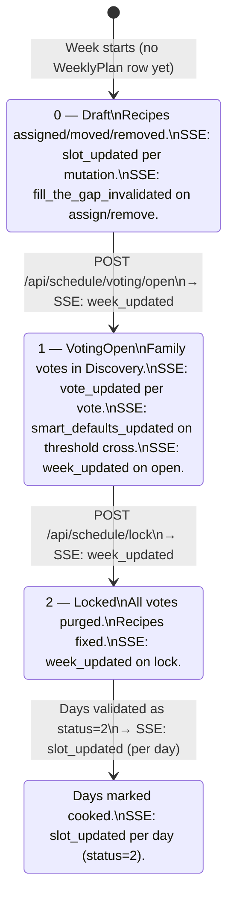

# Data Flow: Week Lifecycle — SSE-Aware

**Spec:** `.kiro/specs/00-live-schedule` — R1, R3, R14 (multi-week SSE correctness)
**Supersedes:** [`docs/flows/user-flows/planner-week-lifecycle.md`](../user-flows/planner-week-lifecycle.md) (pre-SSE version, preserved for historical context)
**Related docs:** [`grocery-sse-sync.md`](./grocery-sse-sync.md), [`planner-drag-sse.md`](./planner-drag-sse.md), [`client-domain-model.md`](../client-domain-model.md)

---

## Overview

A week plan moves through four server-side states. With SSE, every transition publishes an event that updates all connected clients immediately — no polling, no navigation required.

This document covers:
- The state machine with SSE events at each transition
- Which stores update on each event
- Multi-week correctness (week 0 vs week 1)
- The `connected` event snapshot and its role in store seeding

---

## Week Status State Machine (SSE-Aware)



---

## SSE Events at Each Transition

### Draft → Slot Assigned

```
POST /api/schedule/assign
  → DB: INSERT CalendarEvent
  → GroceryRecomputeService: recompute grocery + balance_summary
  → SSE: slot_updated { date, recipe, status: 0 }
  → SSE: fill_the_gap_invalidated { weekOffset }
  → SSE: discovery_nudge { nextFoodGroup, reason } (conditional — only when a group newly hits its target)
```

**Stores updated:**
- `weekStore.applySlotUpdate({ date, recipe, status })` — updates the day card
- `discoveryStore.invalidateFillTheGap(weekOffset)` — triggers Discovery page silent refetch
- `discoveryStore.setActiveCategory(nextFoodGroup)` — on `discovery_nudge`, steers the discovery stack toward the most under-represented food group

### Draft → Slot Removed

```
DELETE /api/schedule/day/{date}/remove
  → DB: DELETE CalendarEvent
  → SSE: slot_updated { date, recipe: null, status: 0 }
  → SSE: fill_the_gap_invalidated { weekOffset }
```

**Stores updated:** same as assign.

### Draft → Slot Moved

```
POST /api/schedule/move
  → DB: UPDATE CalendarEvent positions
  → SSE: week_updated { schedule: ScheduleDays }
```

Move affects multiple days, so a full snapshot is pushed rather than individual `slot_updated` events.

**Stores updated:**
- `weekStore.applySnapshot(schedule)` — replaces full week state

### Draft → VotingOpen

```
POST /api/schedule/voting/open
  → DB: UPDATE WeeklyPlan SET Status=1
  → SSE: week_updated { schedule: ScheduleDays }
```

**Stores updated:**
- `weekStore.applySnapshot(schedule)` — `status` field updates to `1`; planner header shows "Voting live" badge

### VotingOpen → Vote Cast

```
POST /api/discovery/{id}/vote
  → DB: INSERT RecipeVote
  → SSE: vote_updated { recipeId, voteCount }
  → (if threshold crossed) SSE: smart_defaults_updated { weekOffset, defaults }
```

**Stores updated:**
- `weekStore.applyVoteUpdate({ recipeId, voteCount })` — vote badge on planner day card
- `discoveryStore.applyVoteUpdate({ recipeId, voteCount })` — `hasFamilyInterest` flag + re-rank in discovery stack
- (on threshold) `weekStore.applySmartDefaultsUpdate(defaults)` — pending slots seeded with consensus picks

### VotingOpen → Locked

```
POST /api/schedule/lock
  → DB: UPDATE WeeklyPlan SET Status=2; DELETE RecipeVotes; persist VoteCount to CalendarEvent
  → SSE: week_updated { schedule: ScheduleDays }
```

**Stores updated:**
- `weekStore.applySnapshot(schedule)` — `status` field updates to `2`; planner shows "Menu's In!"

### Any Day → Cooked

```
POST /api/schedule/day/{date}/validate { status: 2 }
  → DB: UPDATE CalendarEvent SET Status=2
  → SSE: slot_updated { date, recipe, status: 2 }
```

**Stores updated:**
- `weekStore.applySlotUpdate({ date, recipe, status: 2 })` — day card shows cooked state
- `todayStore.applyServerUpdate({ recipe, status: 2 })` — if date matches today → `CookedSuccessCard` on all home screens

---

## Full Sequence: Week 0 from Draft to Cooked

```mermaid
sequenceDiagram
    autonumber

    actor Mom
    actor Family as Family Members
    participant Planner as Planner (weekStore)
    participant Home as Home (todayStore)
    participant Discovery as Discovery (discoveryStore)
    participant API as .NET API
    participant SSE as SSE Stream

    %% ─── CONNECTED EVENT ─────────────────────────────────────────────────────
    rect rgb(220, 235, 255)
        note over Planner,SSE: App load — SSE connection established
        SSE-->>Planner: connected { schedule: ScheduleDays (weekOffset=0) }
        Planner->>Planner: weekStore.applySnapshot(schedule)
        note over Planner: schedule seeded; optimisticWriteAt cleared
    end

    %% ─── DRAFT: ASSIGN RECIPES ───────────────────────────────────────────────
    rect rgb(230, 255, 230)
        note over Planner: Status: 0 (Draft)
        Mom->>Planner: Assigns recipe to Monday
        Planner->>API: POST /api/schedule/assign
        API->>SSE: slot_updated { date: Monday, recipe, status: 0 }
        API->>SSE: fill_the_gap_invalidated { weekOffset: 0 }
        SSE-->>Planner: weekStore.applySlotUpdate → Monday card updates
        SSE-->>Discovery: discoveryStore.invalidateFillTheGap → silent refetch
    end

    %% ─── OPEN VOTING ─────────────────────────────────────────────────────────
    rect rgb(255, 245, 210)
        note over Planner: Mom taps "Ask the Family"
        Mom->>Planner: Taps "Ask the Family"
        Planner->>API: POST /api/schedule/voting/open
        API->>SSE: week_updated { schedule (status: 1) }
        SSE-->>Planner: weekStore.applySnapshot → "Voting live" badge
        SSE-->>Family: All connected clients see status=1
    end

    %% ─── FAMILY VOTES ────────────────────────────────────────────────────────
    rect rgb(240, 240, 255)
        Family->>Discovery: Votes on Recipe X
        Discovery->>API: POST /api/discovery/{id}/vote
        API->>SSE: vote_updated { recipeId, voteCount: 2 }
        SSE-->>Planner: weekStore.applyVoteUpdate → vote badge on day card
        SSE-->>Discovery: discoveryStore.applyVoteUpdate → hasFamilyInterest=true, re-rank
        note over API: If voteCount crosses threshold:
        API->>SSE: smart_defaults_updated { weekOffset: 0, defaults }
        SSE-->>Planner: weekStore.applySmartDefaultsUpdate → pending slots seeded
    end

    %% ─── LOCK ────────────────────────────────────────────────────────────────
    rect rgb(255, 230, 230)
        Mom->>Planner: Taps "Plan next week" (≥4 recipes)
        Planner->>API: POST /api/schedule/lock
        API->>SSE: week_updated { schedule (status: 2) }
        SSE-->>Planner: weekStore.applySnapshot → "Menu's In!" shown
        SSE-->>Family: All clients see locked state
    end

    %% ─── COOKED ──────────────────────────────────────────────────────────────
    rect rgb(220, 255, 220)
        Mom->>Home: Completes Cook's Mode for Monday
        Home->>API: POST /api/schedule/day/{monday}/validate { status: 2 }
        API->>SSE: slot_updated { date: Monday, recipe, status: 2 }
        SSE-->>Home: todayStore.applyServerUpdate → CookedSuccessCard (all members)
        SSE-->>Planner: weekStore.applySlotUpdate → Monday shows cooked state
    end
```

---

## `connected` Event — Store Seeding

When the SSE connection is established (or re-established after a disconnect), the server sends a `connected` event with the current week 0 snapshot.

```
event: connected
data: { "type": "connected", "schedule": { "weekOffset": 0, "locked": false, "status": 0, "days": [...] } }
```

**Handler in `useScheduleStream`:**
```typescript
source.addEventListener('connected', (e) => {
  const { schedule } = JSON.parse(e.data);
  useTodayStore.getState().clearOptimisticGuard();
  useWeekStore.getState().applySnapshot(schedule);
});
```

**Why `clearOptimisticGuard` first:** On reconnect, the snapshot is authoritative. Any optimistic write that was in-flight before the disconnect is now confirmed or superseded by the server state. Clearing the guard ensures the snapshot is applied without the 2-second echo window blocking it.

**Limitation:** The `connected` snapshot covers `weekOffset=0` only. If the user is viewing week 1 on the planner, the `connected` event does not update their view. The planner's `init(weekOffset)` REST fetch is the source of truth for non-zero weeks. SSE `slot_updated` events keep week 1 current after that initial fetch.

---

## `applySnapshot` — Smart Defaults Preservation (BS-9)

When `applySnapshot` is called (on `connected` or `week_updated`), it must not clobber pending smart-default slots:

```typescript
applySnapshot(schedule: ScheduleDays) {
  const prev = get().schedule;
  const next = buildScheduleDays(schedule);

  // Preserve _isPending metadata for slots where:
  // - the current store has _isPending=true
  // - the reconnect snapshot has no recipe for that date
  for (const day of next) {
    const prevDay = prev.find(d => d.date === day.date);
    if (prevDay?._isPending && !day.recipe) {
      day._isPending = prevDay._isPending;
      day._voteCount = prevDay._voteCount;
      day._unanimousVote = prevDay._unanimousVote;
    }
  }

  set({ schedule: next, optimisticWriteAt: null });
  usePlannerStore.getState().setGroceryState(schedule.groceryState ?? {});
}
```

This prevents the pending-slot flicker that would otherwise occur every time a `week_updated` event arrives while smart defaults are displayed.

---

## `applySlotUpdate` — Pre-Init Guard (BS-2)

If `applySlotUpdate` is called before `weekStore.init()` has run (i.e. `schedule` is `[]`), the event is silently dropped:

```typescript
applySlotUpdate({ date, recipe, status }) {
  const { schedule } = get();
  if (schedule.length === 0) return; // pre-init guard — connected event will seed correctly
  const inCurrentWeek = schedule.some(d => d.date === date);
  if (!inCurrentWeek) return;
  // ... apply update
}
```

The `WeekStoreInitializer` component (mounted at layout level) calls `init(0)` on app load to ensure `schedule` is never `[]` when the first SSE events arrive.

---

## Multi-Week Correctness (R14)

The planner lets users navigate between weeks. SSE must work correctly for any week the user is viewing.

| User is viewing | SSE event arrives for | `applySlotUpdate` result |
|---|---|---|
| Week 0 | Week 0 date | ✅ Applied — date is in loaded schedule |
| Week 0 | Week 1 date | ✅ Silently ignored — date not in loaded schedule |
| Week 1 | Week 1 date | ✅ Applied — `init(1)` loaded week 1 dates |
| Week 1 | Week 0 date | ✅ Silently ignored — date not in loaded schedule |

**No special handling needed in `useScheduleStream`.** All `slot_updated` events are passed to `weekStore.applySlotUpdate` unconditionally. The `inCurrentWeek` guard in the store is the correct filter.

**`week_updated` events** always carry a full snapshot. `applySnapshot` replaces the entire schedule — this is correct for lock and voting-open events, which affect the whole week regardless of which week the user is viewing. If the user is on week 1 and a week 0 `week_updated` fires, the snapshot will contain week 0 dates, and `applySlotUpdate`'s guard will correctly ignore subsequent week 0 events.

> **Documented gap:** `week_updated` events are currently scoped to `weekOffset=0`. A lock or voting-open on week 1 does not push a `week_updated` for week 1. The planner's `init(1)` REST fetch is the source of truth for week 1 status changes. This is acceptable for the current single-family use case and is documented here as the intended behaviour.

---

## Store Update Summary

| SSE event | `weekStore` | `todayStore` | `discoveryStore` | `plannerStore` |
|---|---|---|---|---|
| `connected` | `applySnapshot` | `clearOptimisticGuard` | — | `setGroceryState` (via applySnapshot) |
| `slot_updated` | `applySlotUpdate` | `applyServerUpdate` (if today) | — | — |
| `week_updated` | `applySnapshot` | — | — | `setGroceryState` (via applySnapshot) |
| `vote_updated` | `applyVoteUpdate` | — | `applyVoteUpdate` | — |
| `smart_defaults_updated` | `applySmartDefaultsUpdate` | — | — | — |
| `fill_the_gap_invalidated` | — | — | `invalidateFillTheGap` | — |
| `grocery_updated` | — | — | — | `setGroceryState` |
| `discovery_nudge` | — | — | `setActiveCategory(nextFoodGroup)` | — |
| `recipe_ready` | — | — | — | — (→ `gotoStore.markReady`, `libraryStore.pushNotification`) |
| `recipe_failed` | — | — | — | — (→ `captureStore.removePending`, `libraryStore.pushNotification`) |

### When `discovery_nudge` fires

`discovery_nudge` is emitted by `GroceryRecomputeService` at the end of `RecomputeForWeekAsync` — which runs on every recipe assign/remove. It fires **only** when a food group's count newly crosses its CFG weekly target (e.g. `proteinDays` went from 2 → 3). It does **not** fire on the first recompute (no previous summary to compare against) and does **not** fire when nothing changed.

Payload: `{ nextFoodGroup: "WholeGrains" | "VegetablesAndFruits" | "ProteinFoods" | null, reason: string }`
- `nextFoodGroup` is the most under-represented group still below its target, or `null` when `isBalanced = true`.

---

## E2E Test Coverage

| Scenario | Test file |
|---|---|
| SSE `slot_updated` → planner day card updates without poll | `planner-full-cycle.spec.ts` |
| SSE `week_updated` → planner status transitions to "Voting live" | `planner-full-cycle.spec.ts` |
| SSE `week_updated` → grocery checkboxes do not flash (jitter regression) | `grocery.spec.ts` |
| SSE `vote_updated` → vote badge appears on planner day card | `planner-full-cycle.spec.ts` |
| SSE `connected` on reconnect → smart-default pending slots preserved | unit test in `weekStore.test.ts` |
| `applySlotUpdate` is no-op when schedule is `[]` | unit test in `weekStore.test.ts` |
