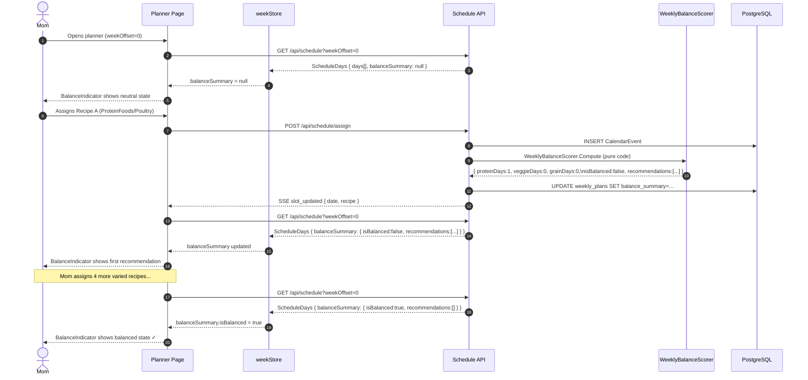
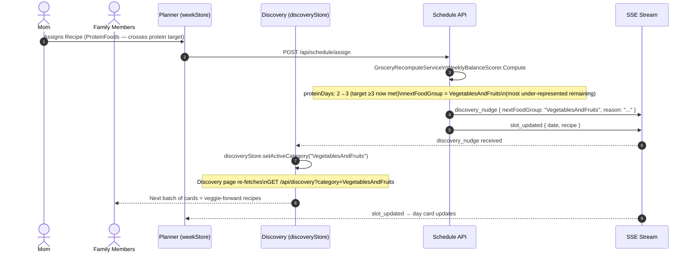

# User Flow: Balance Indicator & Discovery Nudge

**Feature:** Recipe Dietary Categorization — Planner balance indicator and SSE discovery nudge
**Related docs:** [`dietary-classification.md`](../data-flows/dietary-classification.md), [`sse-discovery-live-updates.md`](./sse-discovery-live-updates.md), [`planner-week-lifecycle.md`](./planner-week-lifecycle.md)

---

## Overview

The balance indicator tells a planner at a glance whether their current week's dinners cover the key Canada's Food Guide food groups. It is **display-only** — no action required. The discovery nudge is a real-time SSE event that silently steers the voting stack toward under-represented food groups as the week fills up.

Neither feature involves a live AI call. The balance score is purely deterministic code computed on every assign/remove.

---

## Flow 1: Balance Indicator (Planner Page)

### What the user sees

A compact indicator appears at the top of the planner's weekly view, just above the day cards. It has two states:

**Balanced (all targets met):**
- Sage-green positive state (e.g. a checkmark or "Balanced week ✓" label)
- No recommendations shown
- Non-blocking — planner functions normally beneath it

**Not yet balanced:**
- Shows the first recommendation string from `balanceSummary.recommendations`
- Example: *"Try to include vegetables or fruit in at least 4 dinners."*
- Renders only the first recommendation (most impactful unmet target)
- Still display-only — no CTA, no blocking behaviour

**No recipes assigned:**
- Indicator renders in a neutral/empty state
- `balanceSummary` is `null` until at least one recipe is assigned; the indicator handles this gracefully

### Full sequence



### Component: `<BalanceIndicator>`

`pwa/src/components/planner/BalanceIndicator.tsx`

- Props: `summary: WeeklyBalanceSummaryDto | null`, `className?: string`
- Display-only — no onClick, no routing, no blocking element
- Renders nothing interactive; accessibility role is `status` (not `alert`)
- Never renders a button, modal, or anything that intercepts planner actions

---

## Flow 2: Discovery Nudge (SSE `discovery_nudge`)

### What the user sees

While family members are swiping through the Discovery stack and voting on recipes, the stack **silently filters** itself toward under-represented food groups as the week fills up. The user doesn't need to do anything — the stack adapts.

**Example:**
1. The week currently has 0 plant-based protein dinners (target: ≥ 1).
2. Mom assigns a chicken recipe to Monday. Balance scoring runs.
3. `proteinDays` crosses its target (was 2, now 3).
4. Server emits `discovery_nudge { nextFoodGroup: "VegetablesAndFruits", reason: "..." }`.
5. Discovery stack category filter silently switches to `VegetablesAndFruits`.
6. Next swipe batch shows vegetable-forward recipes — no user action needed.

### Full SSE sequence



### Nudge rules

| Condition | SSE emitted? | `nextFoodGroup` |
|-----------|-------------|-----------------|
| First recompute (no previous summary) | No | — |
| Summary unchanged | No | — |
| A group newly crossed its target | **Yes** | Most under-represented remaining group |
| `isBalanced` flipped `false` → `true` | **Yes** | `null` (all targets met) |

**"Most under-represented"** is determined by the ratio of current count to target. The group furthest below its target as a fraction wins. Example: `grainDays = 0 / 2` (0%) beats `veggieDays = 3 / 4` (75%).

When `nextFoodGroup = null` (week is balanced), `discoveryStore.activeCategory` is cleared — the discovery stack returns to its default (unfiltered) order.

### Store update

`useScheduleStream` handles `discovery_nudge` alongside other SSE events:

```typescript
source.addEventListener('discovery_nudge', (e) => {
  const { nextFoodGroup } = JSON.parse(e.data);
  useDiscoveryStore.getState().setActiveCategory(nextFoodGroup ?? null);
});
```

`discoveryStore.activeCategory` drives the `category` query param on all `GET /api/discovery` fetches from `DiscoveryPage`.

---

## State decision table — BalanceIndicator

| `balanceSummary` | `isBalanced` | `recommendations` | Rendered state |
|---|---|---|---|
| `null` | — | — | Neutral/empty (no error) |
| present | `true` | `[]` | Balanced ✓ (sage positive) |
| present | `false` | `["Add more protein..."]` | First recommendation shown |

---

## Design constraints (Mère-Designer)

- **Display-only:** The indicator must never render a button, form, or blocking overlay. It is ambient feedback, not a call to action.
- **Non-blocking:** The planner day cards and all planner actions must be fully reachable regardless of indicator state.
- **Solar Earth aesthetic:** Use sage green for the balanced state; use the standard body/muted palette for the unbalanced recommendation text. No alerts, no red, no alarming language.
- **First recommendation only:** `recommendations` may contain multiple strings, but the indicator shows only `recommendations[0]` — the highest-priority unmet target. Showing all would clutter the header area.
