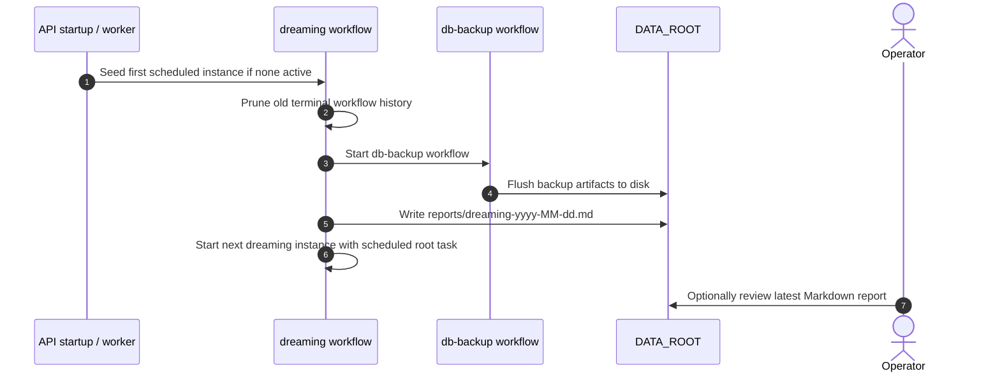
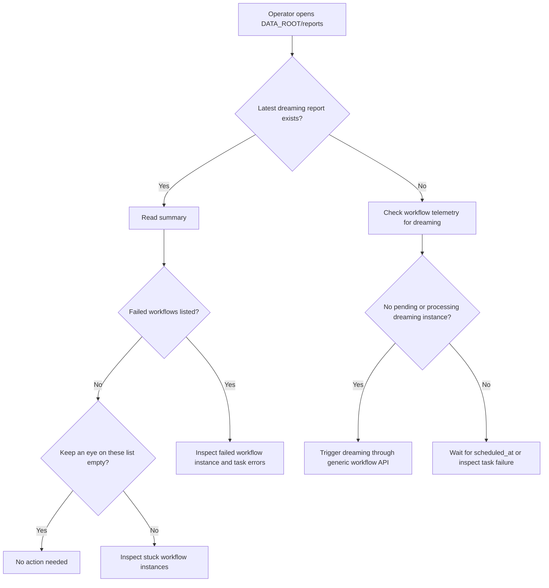

# Flow: Dreaming Maintenance Operations

This flow describes how an operator understands and intervenes in the recurring Dreaming maintenance cycle.

Dreaming is intentionally quiet. A family member should not have to think about it during normal meal planning. It exists for system health: prune old workflow history, trigger backup, write a report, and schedule the next run.

## Normal nightly flow



## Operator check flow

The operator checks Dreaming when something feels off, after deployment, or as part of routine maintenance.



## Manual trigger path

Dreaming does not have a custom public endpoint. It uses the existing generic workflow trigger API like every other workflow.

```http
POST /api/workflows/dreaming/trigger
Content-Type: application/json

{
  "parameters": {}
}
```

Use this when:

- validating a deployment,
- restoring a broken recurring chain,
- forcing an immediate maintenance pass after a large workflow migration.

Do not use manual triggering as the normal schedule. The final Dreaming task owns scheduling the next instance.

## Human-readable states

| Observation | Meaning | Operator action |
|-------------|---------|-----------------|
| Latest report exists and has no failed/stuck workflows | Dreaming is healthy | None |
| Report lists failed workflows | Some workflow reached terminal failure in the last 24h | Inspect workflow task error messages |
| Report lists "Keep an eye on these" | Workflow is pending/processing longer than expected | Check whether task is legitimately scheduled or stuck |
| No recent report and no active `dreaming` instance | Self-reschedule chain likely broke | Trigger `dreaming` through generic workflow API |
| `dreaming` task failed on `reschedule` | Next run was not scheduled | Fix failure cause, reset/trigger workflow |

## UX principle

Dreaming is operational, not household-facing. It should not interrupt Home, Planner, Search, or Cook's Mode. Its visibility belongs in reports and workflow telemetry until a future admin dashboard exists.
