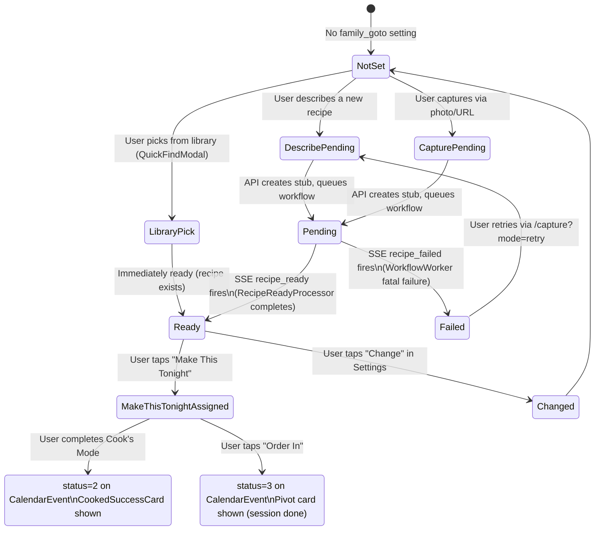
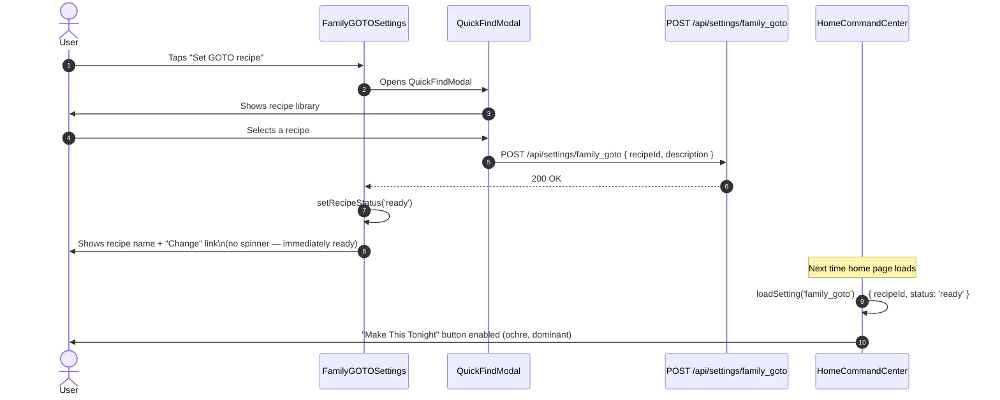
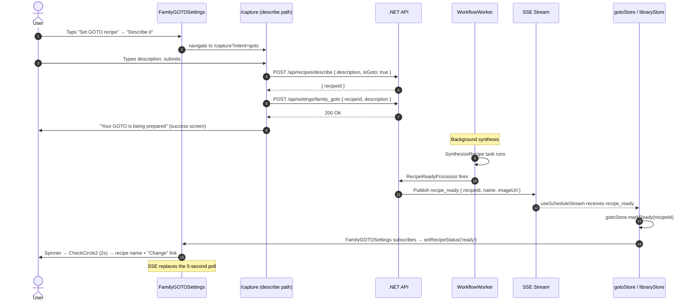
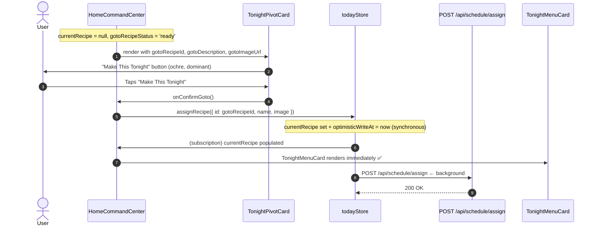
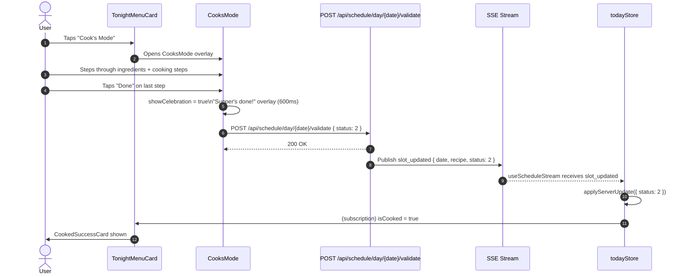

# Flow: GOTO Recipe Lifecycle

**Spec:** `.kiro/specs/00-live-schedule` — Flow 6 / R11 (recipe_ready enriched payload), R15 (honest capture state)
**Related docs:** [`no-menu-goto-home-state.md`](./no-menu-goto-home-state.md), [`sse-capture-async-feedback.md`](./sse-capture-async-feedback.md), [`sse-recipe-ready-notification.md`](./sse-recipe-ready-notification.md)
**Reviewed by:** The Mère-Designer

---

## What is GOTO?

The GOTO recipe is the family's fallback answer to "What's for Supper?" — the meal they always have the ingredients for, that everyone will eat, that requires no planning. It is set once in Settings and surfaces on the home screen whenever no recipe is planned for tonight.

The GOTO lifecycle has three phases:
1. **Set** — the family picks or creates their GOTO recipe
2. **Pending → Ready** — if the recipe needs synthesis (describe/capture paths), it goes through the workflow
3. **In use** — the home screen shows "Make This Tonight"; tapping it assigns the recipe to tonight

---

## State Machine

---

## Path 1: Library Pick (Immediately Ready)

The user opens Settings → GOTO and picks an existing recipe from their library via `QuickFindModal`. The recipe already exists and is synthesized — no workflow needed.

---

## Path 2: Describe It (Pending → Ready via SSE)

The user describes a new recipe in natural language. The API creates a stub and queues the synthesis workflow. The GOTO card shows a spinner until `recipe_ready` fires.

**SSE touchpoint:** `recipe_ready` is the signal that ends the pending state. Before SSE, `FamilyGOTOSettings` polled `GET /api/recipes/{id}/status` every 5 seconds. After SSE, the poll is removed — the card transitions the moment the event arrives.

---

## Path 3: Photo / URL Capture (Pending → Ready via SSE)

Same as Path 2 but the recipe is created via photo upload or URL extraction. The workflow runs `ExtractRecipe` before synthesis.

The SSE flow is identical — `recipe_ready` fires when `RecipeReadyProcessor` completes, regardless of which workflow path was taken.

---

## FamilyGOTOSettings Card States

The `FamilyGOTOSettings` component in `/profile/settings` renders differently based on `recipeStatus`:

| `recipeStatus` | `recipeId` | Card content |
|---|---|---|
| `null` (not set) | null | "Set your family's GOTO recipe" CTA |
| `'pending'` | set | Spinner + "Usually ready in under 10 seconds" + muted description echo + "Change" link |
| `'ready'` | set | Recipe name + optional thumbnail + "Change" link |
| `'failed'` | set | Error state + "Try again" CTA → `/capture?recipeId={id}&mode=retry` |

### Pending state UX (Mère-Designer ruling)

The pending spinner must not be a blank wait. Show:
- **Spinner** (solar loader, ochre, 24px)
- **Subtitle:** `"Usually ready in under 10 seconds"` — `text-xs text-charcoal/40`
- **Description echo:** the text the user typed, muted (`text-charcoal/40`) — confirms the right thing was submitted
- **"Change" link** — the escape hatch if the user wants to pick something different

### Ready state transition

When `recipe_ready` fires:
1. Replace spinner with `CheckCircle2` (sage, 20px) — brief scale-in animation
2. Hold for 2 seconds
3. Collapse to: recipe name + "Change" link

---

## "Make This Tonight" — Home Screen

Once the GOTO recipe is ready, the home screen pivot card shows the primary CTA.

---

## Cooked Path

After "Make This Tonight" assigns the recipe, the user cooks it via Cook's Mode.

**SSE touchpoint:** `slot_updated` with `status: 2` propagates the cooked state to all connected family members simultaneously. Jordan's home screen transitions to `CookedSuccessCard` without any action on her part.

---

## SSE Touchpoints Summary

| SSE event | When it fires | What updates |
|---|---|---|
| `recipe_ready` | RecipeReadyProcessor completes synthesis | `gotoStore.markReady(recipeId)` → `FamilyGOTOSettings` spinner → recipe name; `LibraryToast` if user navigated away |
| `recipe_failed` | WorkflowWorker fatal failure (all retries exhausted) | `captureStore.removePending(recipeId)` → `RecipeFailureBanner` with retry CTA |
| `slot_updated` (status: 2) | Cook's Mode "Done" → validate API | `todayStore.applyServerUpdate` → `CookedSuccessCard` on all members' home screens |
| `slot_updated` (status: 3) | "Order In" → validate API | `todayStore.applyServerUpdate` → pivot card shown (session done) |

---

## E2E Test Coverage

| Scenario | Test file |
|---|---|
| GOTO pending → spinner + "Usually ready" subtitle shown | `home-goto.spec.ts` |
| SSE `recipe_ready` → spinner replaced by recipe name (no poll) | `home-goto.spec.ts` |
| "Make This Tonight" → menu card immediately (no network wait) | `home-goto.spec.ts` |
| Cook's Mode "Done" → CookedSuccessCard shown | `cooks-mode.spec.ts` |
| SSE `slot_updated` status=2 → other member sees CookedSuccessCard | `home-recipe.spec.ts` |
