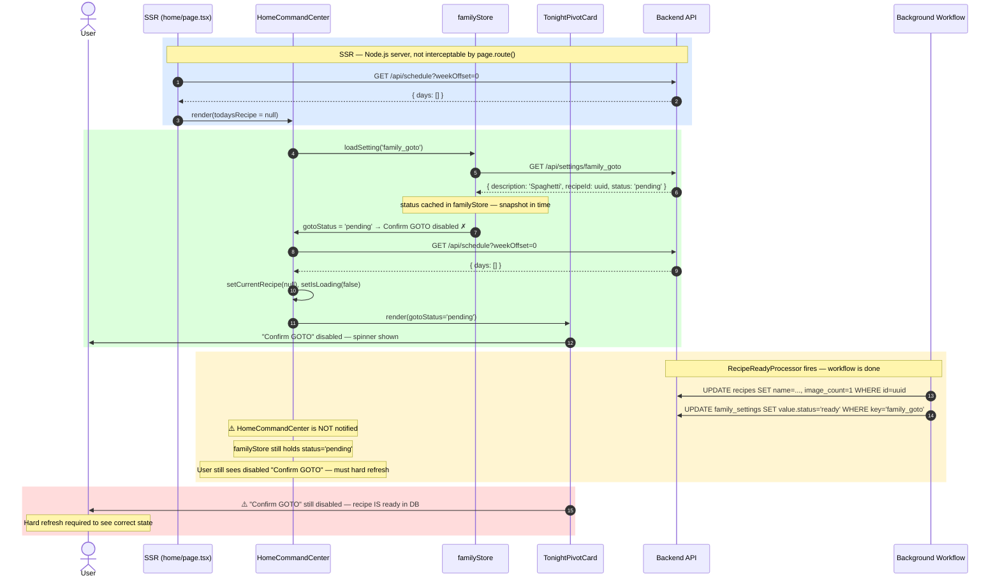
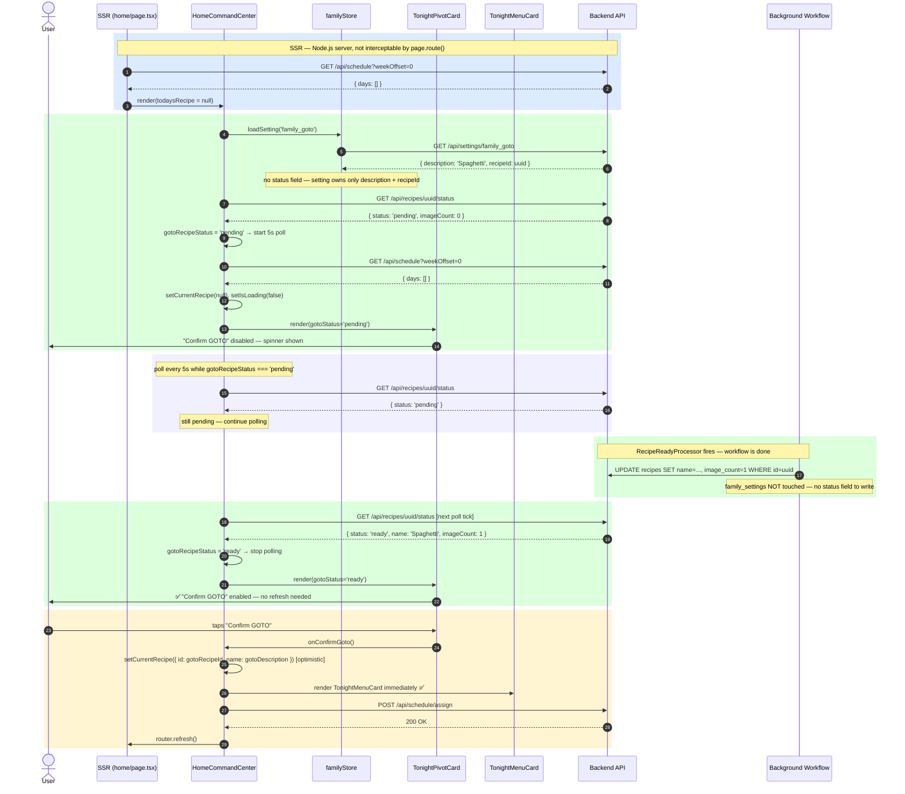

# Flow: No Planned Meal + GOTO Configured → Home State

This document traces two models:

1. **Current model (Phase 13 as built)** — recipe readiness embedded in the `family_goto` settings value; goes stale after workflow completes.
2. **Fixed model (ADR 033)** — recipe readiness derived from `GET /api/recipes/{id}/status`; always current, polls until ready.

Related specs: [phase-12-no-menu.md](../../.kiro/specs/phase-12-no-menu.md), [phase-13-goto-synthesis.md](../../.kiro/specs/phase-13-goto-synthesis.md), [phase-14-ux-hardening.md](../../.kiro/specs/phase-14-ux-hardening.md)  
ADR: [033-recipe-readiness-as-recipe-domain-concern.md](../../specs/decisions/033-recipe-readiness-as-recipe-domain-concern.md)  
Build prompt: [recipe-readiness-domain-fix.md](../../specs/05_BUILD_PROMPTS/recipe-readiness-domain-fix.md)

---

## Current Model — Stale Cache Race

### Why the stale cache forms

| Step | What happens |
|---|---|
| Mount | `loadSetting` fetches and caches `status: 'pending'` in `familyStore` |
| Workflow completes | `MarkGotoReadyProcessor` writes `status: 'ready'` to DB and `family_settings` |
| HCC / Settings UI | Still reading from stale `familyStore` cache — no re-fetch triggered |
| User experience | Spinner persists indefinitely; "Confirm GOTO" stays disabled |

---

## Fixed Model — Readiness from Recipe Domain (ADR 033)

---

## State Decision Table

`HomeCommandCenter` renders one of three views, in priority order:

| Priority | Condition | View shown |
|----------|-----------|------------|
| 1 | `isLoading === true` | `SolarLoader` |
| 2 | `isCooked === true` | `CookedSuccessCard` |
| 3 | `!currentRecipe \|\| isSkipped \|\| sessionDone` AND `!isCooked` | `TonightPivotCard` |
| 4 | `currentRecipe && currentRecipe.id && currentRecipe.name && !isSkipped && !isCooked && !sessionDone` | `TonightMenuCard` |

Note: condition 4 requires both `id` and `name` to be non-null. A recipe with `name = null` (broken import state) falls through to `TonightPivotCard`. This is the Phase 14 D3 guard.

`TonightPivotCard` — "Confirm GOTO" button state (fixed model):

| `gotoRecipeStatus` | `gotoRecipeId` | Button state |
|---|---|---|
| `'ready'` | non-null | ✅ Enabled |
| `'pending'` | non-null | ❌ Disabled — spinner shown |
| `null` (fetch not complete yet) | non-null | ❌ Disabled — loading |
| any | null | ❌ Disabled — "Set your GOTO →" |

---

## How GOTO is Set — Readiness by Input Path

All capture-originated paths share the same `pending → ready` lifecycle via `RecipeReadyProcessor`. The input method only affects the first processor in the workflow chain.

| How GOTO was set | Workflow first step | `recipeId` in setting when? | Recipe status journey |
|---|---|---|---|
| Library pick (QuickFindModal) | none — recipe exists | at save time | immediately `ready` (name + images exist) |
| Describe it | `SynthesizeRecipe` | after `POST /api/recipes/describe` returns | `pending` → `ready` via `RecipeReadyProcessor` |
| Camera / gallery | `ExtractRecipe` | after capture upload returns | `pending` → `ready` via `RecipeReadyProcessor` |

The `family_goto` setting stores `{ description, recipeId }` in all cases. Readiness is always read from `GET /api/recipes/{id}/status`.

---

## E2E Test Coverage (Fixed Model)

| Scenario | Test file | Status |
|----------|-----------|--------|
| No recipe → pivot card shown | `home-race.spec.ts` | ✅ |
| GOTO ready → Confirm GOTO enabled | `home-race.spec.ts` | ✅ (updated — recipe status mock) |
| Confirm GOTO → menu card immediately (optimistic) | `home-race.spec.ts` | ✅ |
| Quick Find → menu card immediately (optimistic) | `home-race.spec.ts` | ✅ |
| GOTO pending → Confirm GOTO disabled | `home-recovery.spec.ts` | ✅ (updated — recipe status mock) |
| Pending GOTO polls until ready | `home-race.spec.ts` | ✅ (new — Phase C4) |
| SSR returns name=null → pivot card shown (not menu card) | — | ❌ Gap — needs unit test with null-name SSR prop |

### SSR constraint (unchanged)

SSR fetches go to `API_INTERNAL_URL` from the Node.js process — `page.route()` cannot intercept them. The "no recipe tonight" state is reached via the client-side reconciliation fetch returning `days: []`, not by mocking SSR. See [ADR 032](../../specs/decisions/032-ssr-bypass-e2e-testing-pattern.md) and [`.kiro/steering.md` §6](../../.kiro/steering.md).
