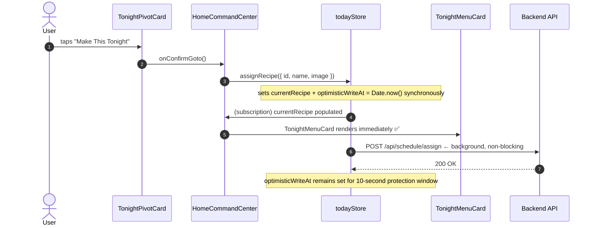

# Flow: No Planned Meal + GOTO Configured → Home State

> ✅ **Updated for `home-command-center-hardening`.**
>
> This document reflects the corrected implementation after the hardening spec:
> - `todayStore` is the single source of truth for today's recipe and status.
> - The primary action button is labelled **"Make This Tonight"** (prop name `onConfirmGoto` is unchanged).
> - Empty state shows an ochre CTA pill in the footer: **"Add your family's GOTO recipe"**.
> - `router.refresh()` is no longer called from any action handler.
> - Background sync uses a 10-second optimistic write protection window.
>
> Historical context (Phase 13 stale-cache model) is preserved in the [Historical Model](#historical-model--phase-13-stale-cache) section below.

Related specs: [phase-12-no-menu.md](../../.kiro/specs/phase-12-no-menu.md), [phase-13-goto-synthesis.md](../../.kiro/specs/phase-13-goto-synthesis.md), [phase-14-ux-hardening.md](../../.kiro/specs/phase-14-ux-hardening.md), [home-command-center-hardening](../../.kiro/specs/home-command-center-hardening/)  
ADR: [033-recipe-readiness-as-recipe-domain-concern.md](../../specs/decisions/033-recipe-readiness-as-recipe-domain-concern.md)

---

## Current Model — todayStore as State Owner

`todayStore` (`pwa/src/store/todayStore.ts`) is the Zustand store that owns all today-scoped recipe and status state. `HomeCommandCenter` reads from it exclusively; it holds no local state for `currentRecipe`, `isCooked`, `isSkipped`, `sessionDone`, or `isLoading`.

### State shape

```ts
interface TodayState {
  currentRecipe: { id: string; name: string; image: string } | null;
  status: 0 | 2 | 3;   // 0 = none, 2 = cooked, 3 = ordered-in / skipped
  isLoading: boolean;
  lastSyncedAt: number | null;
  optimisticWriteAt: number | null;
}
```

Derived flags in `HomeCommandCenter`:

```ts
const isCooked    = status === 2;
const isSkipped   = status === 3;
const sessionDone = status === 2 || status === 3;
```

### Mount sequence

```mermaid
sequenceDiagram
    autonumber

    actor User
    participant SSR as SSR (home/page.tsx)
    participant HCC as HomeCommandCenter
    participant Store as todayStore
    participant PivotCard as TonightPivotCard
    participant Backend as Backend API

    rect rgb(220, 235, 255)
        note over SSR,Backend: SSR — Node.js server
        SSR->>Backend: GET /api/schedule?weekOffset=0
        Backend-->>SSR: ScheduleDays
        SSR->>HCC: render(todaysRecipe, todayStatus)
    end

    rect rgb(220, 255, 220)
        note over HCC: useEffect on mount
        HCC->>Store: init(todaysRecipe, todayStatus)
        note over Store: sets currentRecipe + status; clears optimisticWriteAt
        HCC->>Backend: GET /api/settings/family_goto
        Backend-->>HCC: { description, recipeId }
        HCC->>Store: sync()  ← background, non-blocking
        Store->>Backend: GET /api/schedule?weekOffset=0
        Backend-->>Store: ScheduleDays
        note over Store: reconciles — skips if optimisticWriteAt within 10 s
        Store->>HCC: (Zustand subscription) currentRecipe, status updated
    end

    HCC->>PivotCard: render — empty state (currentRecipe = null, status = 0)
    PivotCard->>User: "What's for Supper?" header, ochre CTA in footer
```

### Pivot card render condition

`TonightPivotCard` is shown when **all** of the following are true:

```
!currentRecipe && !isSkipped && !sessionDone && !isCooked
```

Do not revert this condition. The previous `!currentRecipe || isSkipped || sessionDone` form was incorrect.

### View priority table

`HomeCommandCenter` renders views in priority order. Multiple views can be visible simultaneously (e.g. a cooked badge alongside the voting nudge card).

| Priority | Condition | View shown |
|----------|-----------|------------|
| 1 | `isLoading === true` | `SolarLoader` (replaces all below) |
| 2a | `isCooked && !cookedDismissed` | `CookedSuccessCard` (full card) |
| 2b | `isCooked && cookedDismissed` | Compact cooked badge (tap → Cook's Mode) |
| 3 | `!currentRecipe && !isSkipped && !sessionDone && !isCooked` | `TonightPivotCard` |
| 4 | `currentRecipe && currentRecipe.id && currentRecipe.name && !isSkipped && !isCooked && !sessionDone` | `TonightMenuCard` |

Notes:
- `cookedDismissed` is UI-only local state in `HomeCommandCenter`. Dismissing `CookedSuccessCard` collapses it to the compact badge; `todayStore.status` remains `2`.
- Condition 4 requires both `id` and `name` to be non-null. A recipe with `name = null` (broken import state) falls through to `TonightPivotCard`. This is the Phase 14 D3 guard.
- The compact cooked badge (2b) taps into `CooksMode` so the user can recover from an accidental "Done" tap.

---

## Empty State — No GOTO Configured

When `gotoRecipeId` is null/falsy:

- Header: **"What's for Supper?"**
- Image area: centered `<Utensils>` icon only — no `<a>` tag, no gradient overlay
- Footer: full-width ochre pill button (`h-12 rounded-[1.5rem]`, white text) linking to `/profile/settings` with label **"Add your family's GOTO recipe"**

---

## GOTO-Ready State — "Make This Tonight"

When `gotoRecipeStatus === 'ready'`:

- Header: **"Tonight's Menu"**
- Prep-time badge: shown
- Primary button: **"Make This Tonight"** (ochre, dominant)
- Secondary buttons: **"Quick Find"** (ghost, `border border-indigo/30 bg-transparent`) and **"Order In"** (ghost, `border border-charcoal/20 bg-transparent`)

The prop name `onConfirmGoto` is preserved across all callers — only the UI label changed.

### "Make This Tonight" tap sequence


```mermaid
sequenceDiagram
    autonumber

    actor User
    participant PivotCard as TonightPivotCard
    participant HCC as HomeCommandCenter
    participant Store as todayStore
    participant MenuCard as TonightMenuCard
    participant Backend as Backend API

    User->>PivotCard: taps "Make This Tonight"
    PivotCard->>HCC: onConfirmGoto()
    HCC->>Store: assignRecipe({ id, name, image })
    note over Store: sets currentRecipe + optimisticWriteAt = Date.now() synchronously
    Store->>HCC: (subscription) currentRecipe populated
    HCC->>MenuCard: TonightMenuCard renders immediately ✅
    Store->>Backend: POST /api/schedule/assign  ← background, non-blocking
    Backend-->>Store: 200 OK
    note over Store: optimisticWriteAt remains set for 10-second protection window
```

No `router.refresh()` is called. The menu card appears immediately via the Zustand subscription.

---

## GOTO Pending State

When `gotoRecipeStatus === 'pending'`:

- "Make This Tonight" button is disabled; spinner shown
- Polling continues every 5 s via `GET /api/recipes/{id}/status` until `status === 'ready'`

| `gotoRecipeStatus` | `gotoRecipeId` | Button state |
|---|---|---|
| `'ready'` | non-null | ✅ Enabled — "Make This Tonight" |
| `'pending'` | non-null | ❌ Disabled — spinner shown |
| `null` (fetch not complete) | non-null | ❌ Disabled — loading |
| any | null | Footer CTA only — "Add your family's GOTO recipe" |

---

## Background Sync — Optimistic Write Protection

`todayStore.sync()` is called on mount (non-blocking) and can be called at any time to reconcile with the server schedule.

Reconciliation rules:

| `optimisticWriteAt` | Elapsed since write | Sync behaviour |
|---|---|---|
| `null` | — | Always update `currentRecipe` from server |
| set | < 10 000 ms | Skip update — protect the optimistic write |
| set | ≥ 10 000 ms | Update `currentRecipe` from server |

This prevents a background sync from clobbering an optimistic recipe assignment that hasn't yet been confirmed by the server.

---

## How GOTO is Set — Readiness by Input Path

All capture-originated paths share the same `pending → ready` lifecycle via `RecipeReadyProcessor`.

| How GOTO was set | Workflow first step | `recipeId` in setting when? | Recipe status journey |
|---|---|---|---|
| Library pick (QuickFindModal) | none — recipe exists | at save time | immediately `ready` (name + images exist) |
| Describe it | `SynthesizeRecipe` | after `POST /api/recipes/describe` returns | `pending` → `ready` via `RecipeReadyProcessor` |
| Camera / gallery | `ExtractRecipe` | after capture upload returns | `pending` → `ready` via `RecipeReadyProcessor` |

The `family_goto` setting stores `{ description, recipeId }` in all cases. Readiness is always read from `GET /api/recipes/{id}/status`.

---

## E2E Test Coverage

| Scenario | Test file | Status |
|----------|-----------|--------|
| No recipe → pivot card shown, "What's for Supper?" header | `home-goto.spec.ts` | ✅ |
| Empty state → ochre CTA in footer (not buried in image area) | `home-goto.spec.ts` | ✅ |
| GOTO ready → "Make This Tonight" enabled | `home-goto.spec.ts` | ✅ |
| "Make This Tonight" tap → menu card immediately (no network wait) | `home-goto.spec.ts` | ✅ |
| Page reload after "Make This Tonight" → menu card still shown | `home-goto.spec.ts` | ✅ |
| Quick Find → menu card immediately (optimistic) | `home-goto.spec.ts` | ✅ |
| GOTO pending → "Make This Tonight" disabled, spinner shown | `home-goto.spec.ts` | ✅ |
| "Order In" with no recipe → backend write, pivot hidden | `home-recipe.spec.ts` | ✅ |
| "Order In" with recipe → `SkipRecoveryDialog` opens first | `home-recipe.spec.ts` | ✅ |
| Page reload after "Order In" → pivot card not shown | `home-recipe.spec.ts` | ✅ |
| SSR returns name=null → pivot card shown (not menu card) | — | ❌ Gap — needs unit test with null-name SSR prop |

> **Note:** `home-recovery.spec.ts` was deleted in `952d879` and split into `home-goto.spec.ts` and `home-recipe.spec.ts`. `home-race.spec.ts` covers polling and optimistic scenarios.

### SSR constraint (unchanged)

SSR fetches go to `API_INTERNAL_URL` from the Node.js process — `page.route()` cannot intercept them. The "no recipe tonight" state is reached via the client-side `sync()` call returning `days: []`, not by mocking SSR. See [ADR 032](../../specs/decisions/032-ssr-bypass-e2e-testing-pattern.md) and [`.kiro/steering.md` §6](../../.kiro/steering.md).

---

## Historical Model — Phase 13 Stale Cache

> This section is preserved for archaeological context only. It describes the broken pre-fix behaviour.

The Phase 13 model embedded recipe readiness in the `family_goto` settings value (`status: 'pending' | 'ready'`). This caused a stale-cache race: `HomeCommandCenter` cached the status at mount time and was never notified when `MarkGotoReadyProcessor` wrote `status: 'ready'` to the DB. The user had to hard-refresh to see the correct state.

This was superseded by ADR 033 (readiness from recipe domain) and fully resolved by the `home-command-center-hardening` spec (todayStore + optimistic writes).

The old "Current Model" sequence diagram and stale-cache table have been removed. See git history for the pre-fix version of this file.
