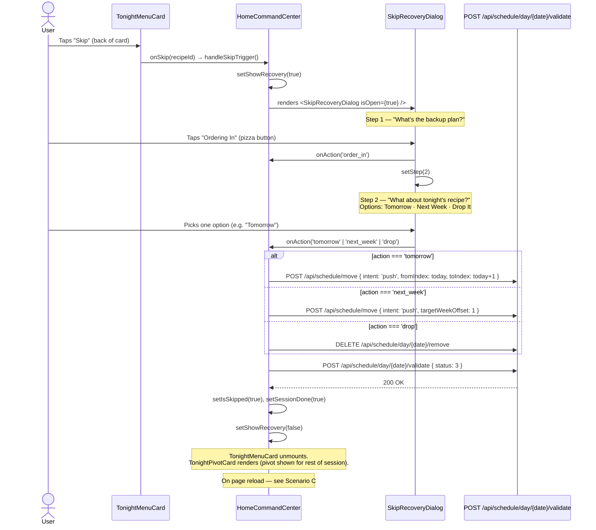
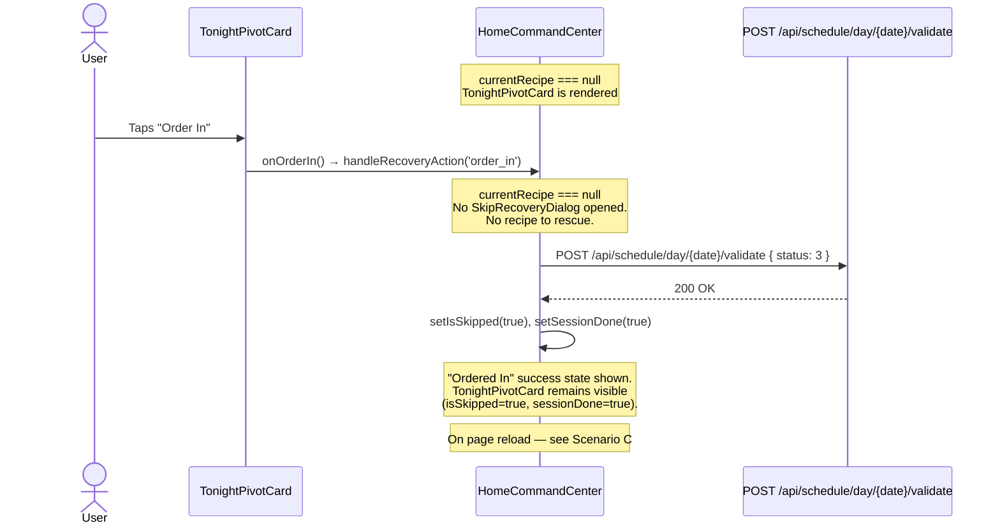
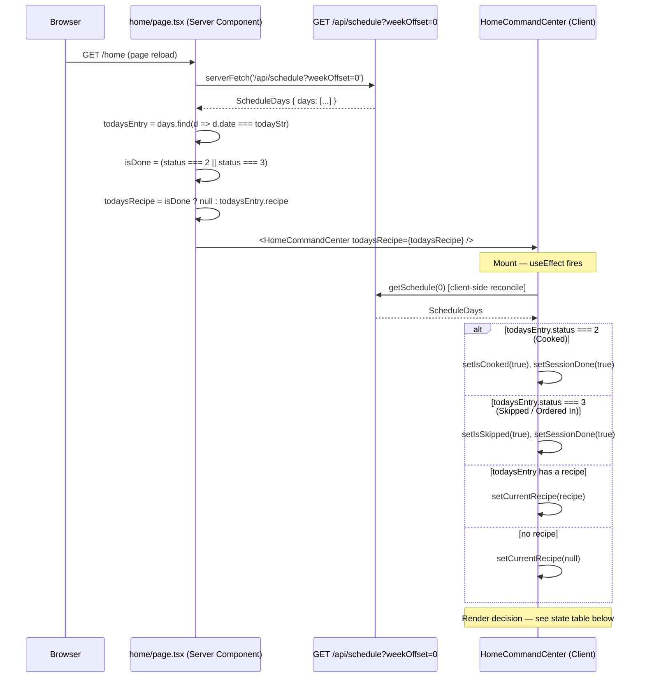

# Order-In Flow

**What's for Supper — PWA**
Documents the two paths a user can take to log an "Order In" night, plus how that state persists across a page reload via SSR.

---

## Scenario A — Order In from TonightMenuCard (recipe is planned)

The user has a recipe scheduled for tonight. They open the ingredient flip-side of the card and tap **Skip**.

> **Note on `status: 3`:** The validate call with `status: 3` (Skipped) is made for the "Order In" branch regardless of which recipe-rescue option the user picks. The recipe-rescue action (tomorrow / next_week / drop) is a separate move/delete call that runs first.

---

## Scenario B — Order In from TonightPivotCard (no recipe planned)

The user has no recipe scheduled tonight. The pivot card is already showing. They tap **Order In** directly.

> **Key difference from Scenario A:** Because `currentRecipe === null`, the `if (currentRecipe)` guard in `handleRecoveryAction` is false — the validate call still fires (status 3 is always written), but no recipe-rescue dialog or move call is made.

---

## Scenario C — State Persistence via SSR

Shows how `home/page.tsx` reads today's schedule status on the server and how `HomeCommandCenter` initialises its local state from that on mount.

---

## State Decision Table

What `HomeCommandCenter` renders for each `todayStatus` value after the client-side reconcile completes.

| `todaysEntry.status` | `isSkipped` | `isCooked` | `sessionDone` | Card shown |
|---|---|---|---|---|
| `0` — Draft (recipe assigned) | `false` | `false` | `false` | **TonightMenuCard** |
| `0` — Draft (no recipe) | `false` | `false` | `false` | **TonightPivotCard** |
| `2` — Cooked | `false` | `true` | `true` | **CookedSuccessCard** |
| `3` — Skipped / Ordered In | `true` | `false` | `true` | **TonightPivotCard** (done state — pivot visible but session is over) |

> **Why TonightPivotCard for status 3?** The render condition is `(!currentRecipe || isSkipped || sessionDone) && !isCooked`. When `isSkipped=true` and `sessionDone=true`, the pivot card renders but the user has already acted — no further action is expected this session. On reload, the same state is re-derived from the API, so the pivot card is shown in its neutral state (no "Ordered In" toast, just the card).
