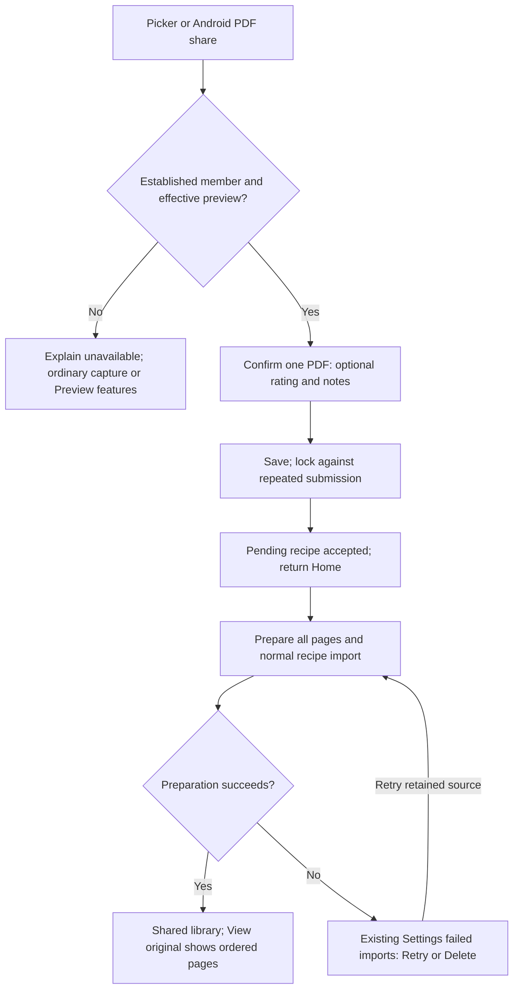

# PDF recipe import preview — user flow

Photo capture stays primary. The existing file picker accepts PDF only when the established member's effective `preview-pdf-recipe-import` flag is enabled; Family GOTO excludes it. Android can deliver one PDF from any compatible sharing app through the installed PWA. iOS uses the picker.

The confirmation has no cooked-dish photo selection and no Cancel. One recipe per PDF; transport limit 20 MiB; processor limit 10 pages with no truncation. No detection/splitting of recipe books and no PDF download.

Interruption, navigation, unlock and member changes discard the unsaved selection and metadata. Unlock requires a fresh share after selecting a member. One pending Android share replaces its predecessor, using token ownership so old cleanup cannot delete the newer share. Submitted jobs continue independently. If upload outcome is uncertain, checking library/Settings before resubmitting can avoid duplicates; duplicates and missed/shared-device feedback remain accepted limitations.

Disabling acquisition leaves existing jobs and completed recipes available under ordinary shared-library rules. Capture does not vote, plan, add groceries or change GOTO. A failed invalid document stays retained; Retry may fail again, and Delete removes failed-import residue through existing maintenance.

See the [user guide](../../user-guide.md#importing-a-pdf-recipe-preview), [PDF data flow](../data-flows/pdf-upload-path.md), and [existing failed-import feedback](sse-recipe-failure-flow.md). Installed OS sharing and phone usability require device evidence; synthetic browser handoffs do not establish them.
