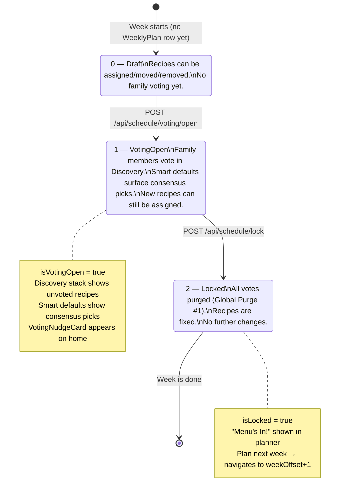
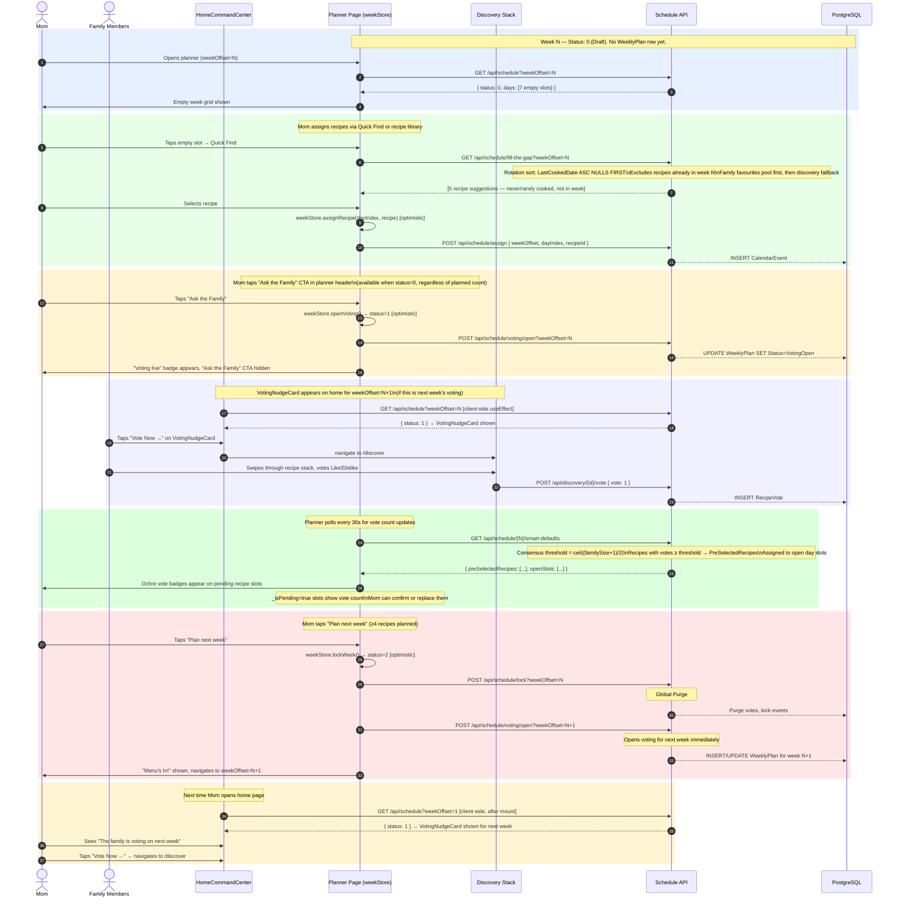
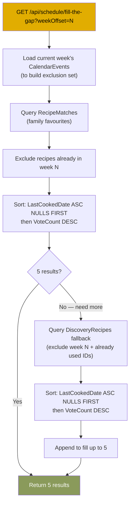
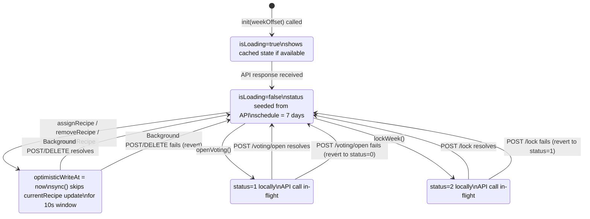
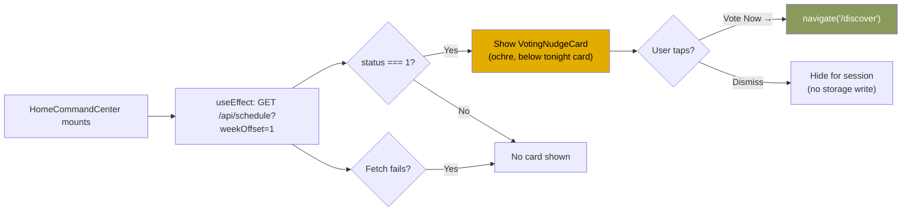

# Flow: Planner Week Lifecycle

Documents the full lifecycle of a week plan — from empty draft through family voting, smart defaults, locking, and the home page voting nudge. Covers both the current implementation and the target state after `planner-voting-ux` spec is implemented.

Related spec: [`.kiro/specs/planner-voting-ux/requirements.md`](../../.kiro/specs/planner-voting-ux/requirements.md)
Digital twin pattern: [`docs/flows/client-domain-model.md`](../client-domain-model.md)

---

## Week Status State Machine

A week moves through three server-side states stored in `WeeklyPlan.Status`:

---

## Full Week Lifecycle Sequence

---

## Quick Find Rotation Sort

---

## weekStore Digital Twin — State Transitions

---

## VotingNudgeCard — Home Page Decision

---

## State Decision Table — Planner Header CTAs

| `status` | `isVotingOpen` | `isLocked` | "Ask the Family" CTA | "Voting live" badge | "Close Voting" btn | "Plan next week" btn |
|----------|---------------|------------|---------------------|--------------------|--------------------|---------------------|
| 0 (Draft) | false | false | ✅ Always shown | ❌ | ❌ | ✅ if ≥4 planned |
| 1 (VotingOpen) | true | false | ❌ | ✅ | ✅ | ✅ if ≥4 planned |
| 2 (Locked) | false | true | ❌ | ❌ | ❌ | ❌ ("Menu's In!") |

> **Current bug:** "Ask the Family" only shows when `plannedCount > 0`. After fix (Req 6): shows whenever `status === 0` and week is not in the past.

---

## Contract Gaps (to fix in spec)

| Gap | Current state | Required fix |
|-----|--------------|--------------|
| `GET /api/schedule` response missing `status` field in OpenAPI schema | `ScheduleDays` schema has `locked` and `weekOffset` but no `status` | Add `status: integer (0\|1\|2)` to `ScheduleDays` schema |
| `GET /api/schedule/fill-the-gap` has no `weekOffset` param | No query param in contract | Add optional `weekOffset: integer` query param |
| `fill-the-gap` sort order not documented | No sort description | Document rotation sort in OpenAPI description |
