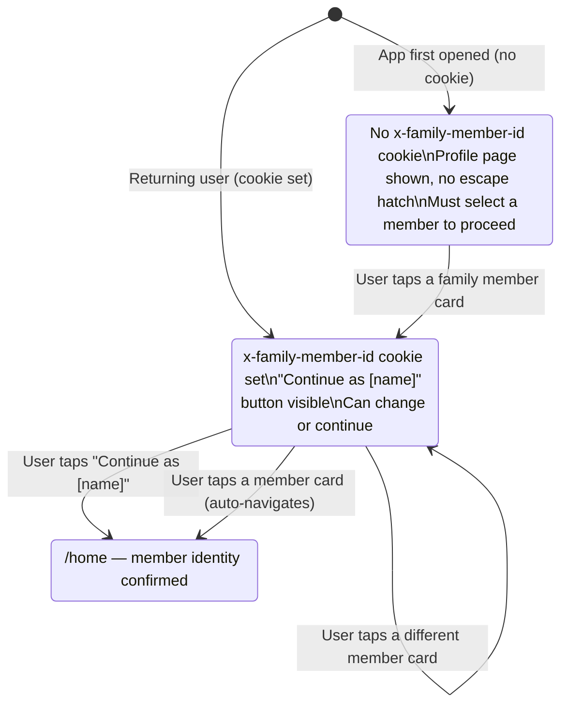
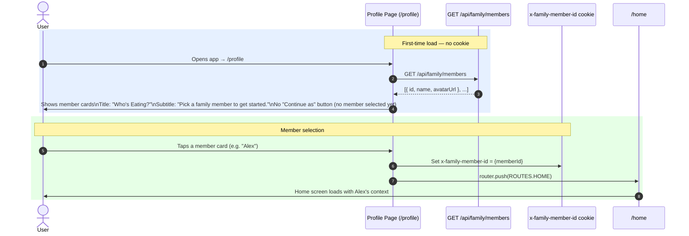
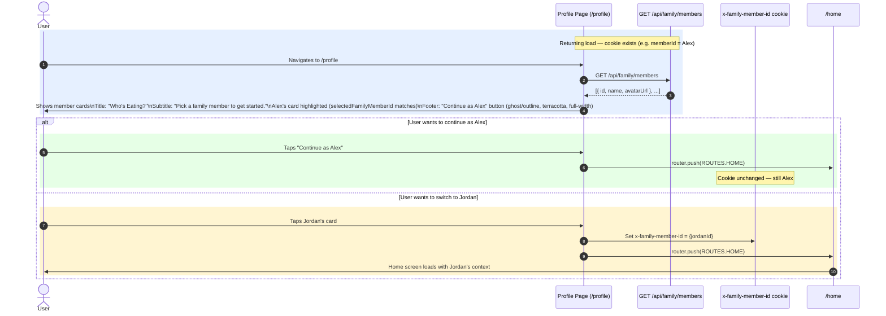

# Flow: "Who's Eating?" — Profile Member Selection

**Spec:** `.kiro/specs/00-live-schedule` — R10 (profile page accessibility + dead-end fix)
**Reviewed by:** The Mère-Designer

---

## Purpose

The profile page is the entry point for family member identity. It answers the question "Who's using the app right now?" and gates the rest of the experience. Every family member has their own view — their votes, their GOTO recipe, their home screen.

This flow documents:
- First-time use (no member selected yet)
- Returning use (member already selected)
- The "Continue as [name]" escape hatch that prevents a dead-end

---

## State Machine



---

## First-Time Use (No Member Selected)

The user opens the app for the first time. No `x-family-member-id` cookie exists. The profile page is the only available screen.



**Key constraint:** When no member is selected, there is no escape hatch. The user must pick a member. The "Continue as [name]" button is not rendered.

---

## Returning Use (Member Already Selected)

The user has previously selected a member. The cookie is set. They navigate to `/profile` to switch members or confirm their identity.



---

## "Continue as [name]" Escape Hatch

The escape hatch solves the dead-end problem: a returning user who navigates to `/profile` by accident (e.g. tapped the wrong nav item) should not be forced to re-select their member. They can tap "Continue as Alex" and return to home without any state change.

**Render condition:**
```typescript
// Only shown when a member is already selected
{selectedFamilyMemberId && (
  <Button variant="ghost" onClick={() => router.push(ROUTES.HOME)}>
    Continue as {currentMemberName}
  </Button>
)}
```

**Placement:** Footer, below the `ProfileDropdown` / member card grid. Full-width. Ghost/outline style, terracotta colour.

**Behaviour:** Calls `router.push(ROUTES.HOME)` without modifying the cookie or any store state.

---

## Page Copy

| Element | Copy |
|---|---|
| Page title | "Who's Eating?" |
| Subtitle | "Pick a family member to get started." |
| Escape hatch button | "Continue as [name]" |
| Hint text colour | `text-charcoal/60` (minimum for WCAG AA on cream background) |

**Mère-Designer ruling on title:** "Family Profile" was corporate jargon. "Who's Eating?" is the actual question the app is answering. It aligns with the app's warmth and directness.

---

## Navigation to Home

After member selection (or "Continue as"), the user lands on `/home`. The home page reads `x-family-member-id` from the cookie to:
- Fetch today's schedule for this member's family
- Load the GOTO recipe setting for this member
- Show the correct voting nudge (if voting is open)

The SSE connection (`useScheduleStream`) is established at layout level and uses the same cookie for auth. No re-connection is needed after member switch — the layout remounts on navigation, which closes and reopens the `EventSource`.

---

## Edge Cases

| Scenario | Behaviour |
|---|---|
| Family has only one member | Single card shown, no "Continue as" button on first use. On return, "Continue as [name]" shown. |
| Cookie set but member deleted from family | API returns 404 on member fetch. Profile page shows all remaining members. No "Continue as" button (selected ID no longer valid). |
| User navigates directly to `/home` without a cookie | `HearthAuthenticationHandler` returns 401. Next.js middleware redirects to `/profile`. |
| Two members use the same device | Each tap of a member card sets the cookie. The last person to tap is the active member. No session isolation — this is a single-family app. |

---

## E2E Test Coverage

| Scenario | Test file |
|---|---|
| Profile page shows "Who's Eating?" title | `profile.spec.ts` |
| No member selected → no "Continue as" button | `profile.spec.ts` |
| Member selected → "Continue as [name]" button visible | `profile.spec.ts` |
| Tapping "Continue as [name]" navigates to /home | `profile.spec.ts` |
| Tapping a different member card navigates to /home | `profile.spec.ts` |
