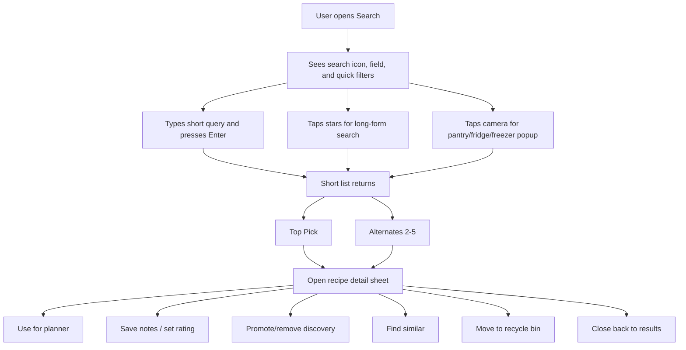
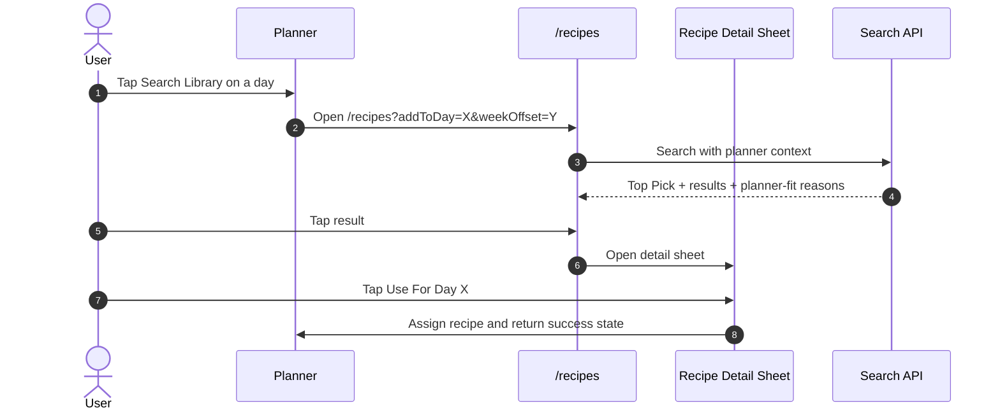
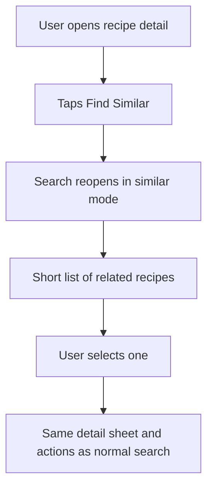
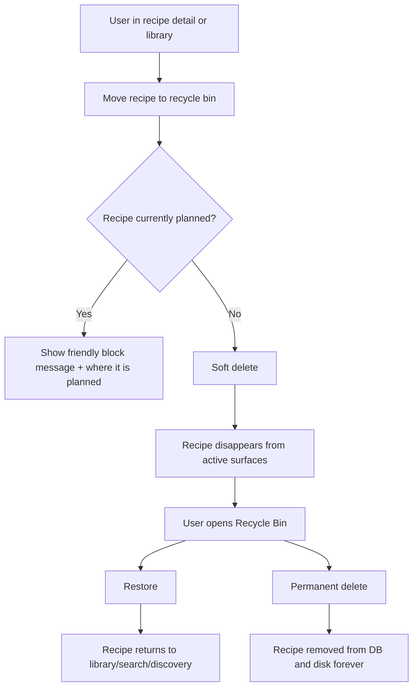
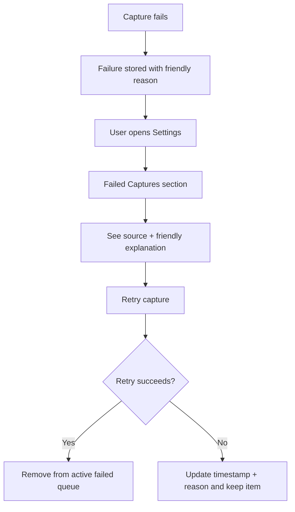

# Flow: Recipe Search And Library Recovery

**Related spec:** `.kiro/specs/semantic-recipe-search/`

This document describes the intended user experience for:
- semantic recipe search,
- stars-triggered long-form super-search,
- pantry/fridge/freezer photo search,
- planner-aware recipe selection,
- recipe detail actions,
- recycle bin restore/purge,
- failed capture recovery in Settings.

---

## North Star

The user should be able to answer "What should we eat?" in seconds, recover from mistakes without panic, and never end up at a dead end.

### Mère-Designer rules applied

- **Why:** Recovery should live next to the thing being recovered.
- **How:** Recycle Bin belongs in the recipe library. Failed captures belong in Settings.
- **Thumb-zone rule:** the primary action on each surface should be reachable and obvious.

---

## Main Search Flow

### Expected feel

- Search results should feel decisive, not exhaustive.
- One strong Top Pick should reduce decision fatigue.
- Closing detail returns to the same search state.
- The main field should feel immediate and cheap.
- The stars affordance should feel like "help me figure it out," not "open chat."

---

## Input Paths

### 1. Default search field

- Search icon + text field only.
- No special lane name.
- `Enter` executes search.

### 2. Stars-triggered long-form search

- The stars/sparkle affordance opens a larger text surface.
- The user can describe a craving, mood, constraint set, or fuzzy memory.
- The result is still a normal shortlist of recipes.

### 3. Camera-triggered inventory search

- The camera icon opens a capture popup.
- The user takes photos of pantry, fridge, or freezer.
- The system extracts likely ingredients and boosts recipes that use what is on hand.

---

## Planner-Aware Search Flow

### No-dead-end rules

1. Planner context is always preserved.
2. The user can back out without losing the query.
3. The result detail provides a direct selection CTA.

---

## Similar Recipe Flow

This prevents the user from having to invent a new query when what they really mean is "more like this."

---

## Recycle Bin Flow

### Primary location

The Recycle Bin should be available from the recipe library/search surface, for example as a utility entry or secondary header action.

**Not recommended as primary location:** Settings.

### Flow

### UX intent

- Soft delete lowers fear.
- Restore is one tap.
- Permanent delete only appears inside Recycle Bin.
- A recipe that is still scheduled should not silently vanish and break the planner.

---

## Failed Captures In Settings

### Primary location

Settings > Failed Captures

### Flow

### Friendly copy examples

- `We couldn't read enough from that page to save it cleanly.`
- `Those photos were too unclear to turn into a recipe.`
- `The recipe service timed out. Try again in a moment.`

The user does not need stack traces to recover.

---

## Decision Table

| Surface | Primary action | Secondary action | Escape hatch |
|---|---|---|---|
| Search page | Open Top Pick or result | toggle quick filter | clear query |
| Recipe detail sheet | Use / Save / Select | find similar, discovery toggle, move to bin | close back to results |
| Recycle Bin | Restore | permanent delete | back to library |
| Failed Captures | Retry | view details | leave item for later |

---

## Empty States

### Search empty state

Show:
- a calm explanation,
- one recovery suggestion,
- one action.

Examples:
- `No close matches yet. Try fewer ingredients or remove a filter.`
- CTA: `Clear Filters`

### Recycle Bin empty state

Show:
- `Nothing in the bin.`
- CTA: `Back to Library`

### Failed Captures empty state

Show:
- `No failed captures right now.`
- optional reassurance copy, no extra action required.

---

## Blind Spots To Watch

1. If delete is allowed for an actively planned recipe, planner state will drift.
2. If the detail sheet does not preserve search state, the user will feel punished for exploring.
3. If failed captures are not persisted, recovery becomes impossible after reload.
4. If the recycle bin is hidden in Settings, accidental restore becomes memory work.
