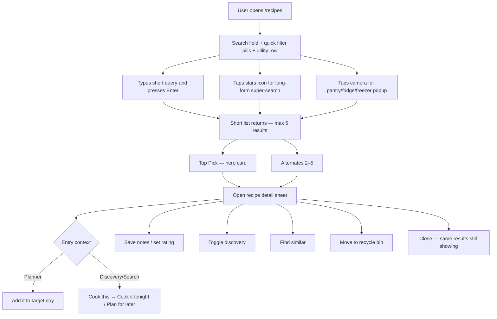
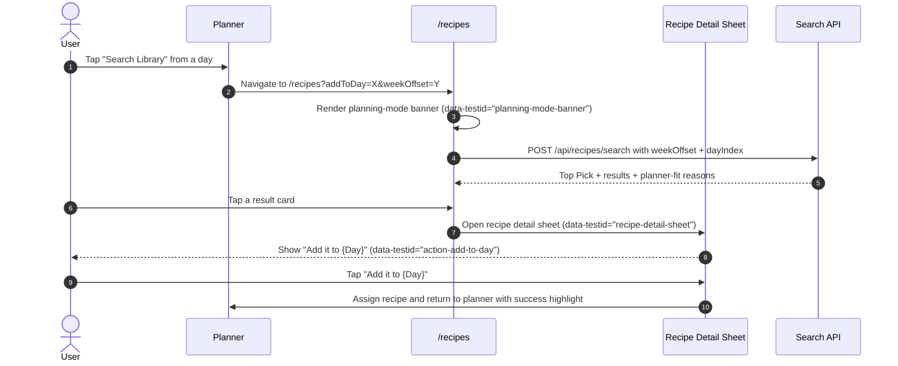
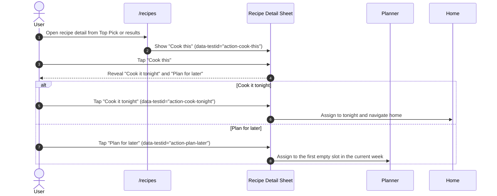
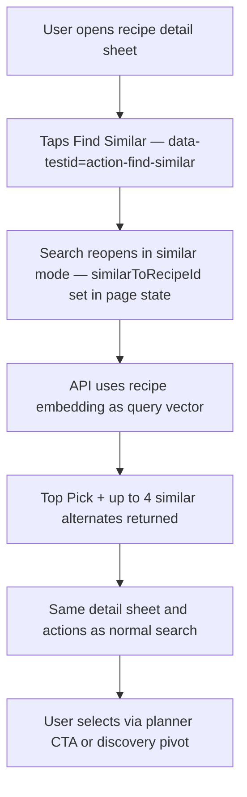
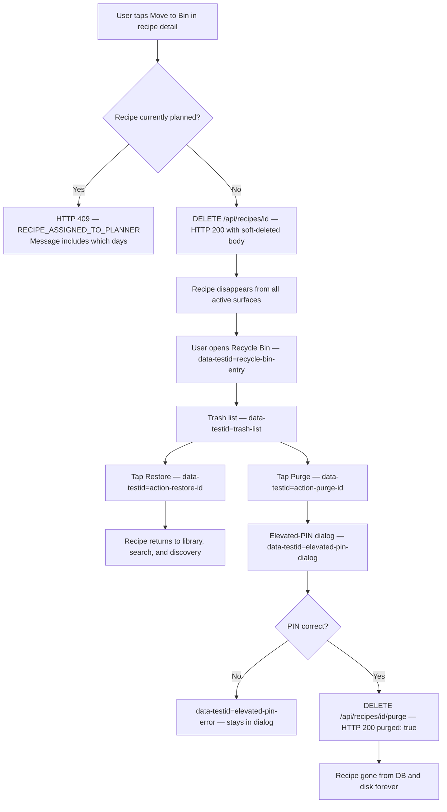
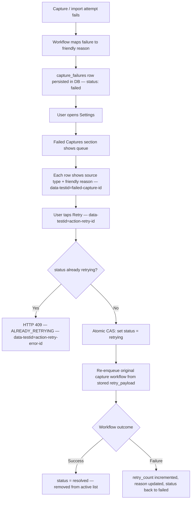

# Flow: Recipe Search And Library Recovery

**Related spec:** `.kiro/specs/semantic-recipe-search-v2/`

This document describes the user experience for:
- semantic recipe search (standard, agent super-search, and pantry photo search),
- planner-aware recipe selection,
- recipe detail actions (notes, rating, discovery, similar),
- soft delete and Recycle Bin restore / permanent purge,
- failed capture recovery in Settings.

---

## North Star

The user should be able to answer "What should we eat?" in seconds, recover from mistakes without panic, and never end up at a dead end.

### Mère-Designer rules applied

- **Why:** Recovery should live next to the thing being recovered.
- **How:** Recycle Bin belongs in the recipe library. Failed captures belong in Settings.
- **Thumb-zone rule:** The primary action on each surface must be reachable in the natural thumb arc on a 6.7″ screen.

---

## Main Search Flow

### Expected feel

- Results should feel decisive, not exhaustive. One strong Top Pick reduces decision fatigue.
- Closing the detail sheet returns to **exactly the same search state** — no re-fetch, no blank page.
- The main field should feel immediate and cheap.
- The stars affordance should feel like "help me figure it out," not "open chat."

---

## Input Paths

### 1. Standard search field

- Search icon + `data-testid="recipe-search-input"` text field.
- `Enter` executes search — no button required.
- No special lane name in the default UI.

### 2. Stars-triggered long-form super-search

- `data-testid="agent-search-trigger"` opens/expands `data-testid="agent-search-input"` textarea.
- The user describes a craving, mood, constraint set, or fuzzy memory.
- Server translates the free-form text to a structured search request (no separate retrieval branch).
- Result is still a normal shortlist of recipes — not a chat transcript.

### 3. Camera-triggered inventory search

- `data-testid="inventory-camera-trigger"` opens `data-testid="inventory-capture-popup"`.
- The user takes one or more photos of pantry, fridge, or freezer. No multi-step wizard before the camera.
- Vision model extracts inferred ingredients into a request-scoped pantry snapshot.
- Snapshot `id` is attached to the search call; recipes with high ingredient overlap are boosted.
- Temporary photos are deleted immediately after snapshot extraction regardless of outcome.
- If the model is busy, server returns HTTP 202 with a `retryAfterSeconds` hint — search still works using the query only.

---

## Planner-Aware Search Flow

When search is opened from the Planner (`/recipes?addToDay=X&weekOffset=Y`), the page enters planner mode and preserves the target slot until the user either assigns a recipe or cancels.

### Planner reranking rules

- Recipes already assigned in the target week are excluded entirely.
- Recipes that close a weekly nutritional gap (e.g. "Helps add vegetables to this week") receive a `+0.20` score boost.
- Queries containing "quick", "fast", or "tonight" boost recipes with `totalTime ≤ 30 min` by `+0.10`.
- The Top Pick's `plannerFitNote` carries a human-readable explanation when planner context is present.

### No-dead-end rules

1. Planner context (`addToDay`, `weekOffset`) is read on mount and held in component state — it does not drive re-renders on URL change.
2. The user can cancel back to the planner with `data-testid="planning-mode-cancel"` without losing the planner state.
3. Opening and closing the detail sheet does not trigger a new search call.
4. Planner-mode recipe details skip the discovery pivot and go straight to the assignment CTA.

---

## Discovery Action Pivot

When search is opened normally (no `addToDay` URL parameter), choosing a recipe is intentionally a two-step decision:

### Pivot intent

- **Cook this** is a commitment prompt, not the final destination.
- **Cook it tonight** is for immediate supper recovery and should return the user to the home flow.
- **Plan for later** keeps the choice useful without forcing the user to pick a specific day from the search surface.
- The pivot is hidden in planner mode because the day has already been chosen.

---

## Similar Recipe Flow

When the target recipe's embedding is not yet available (`index_status = pending` or `stale`), similar search falls back to lexical matching against the recipe's normalized document text.

---

## Recipe Detail Sheet — Action Map

| Context | Initial CTA `data-testid` | Label | Follow-up |
|---------|---------------------------|-------|-----------|
| Planner mode (`addToDay` in URL) | `action-add-to-day` | "Add it to {Day}" | Assigns to the target planner day and returns to planner |
| Standard library/search | `action-cook-this` | "Cook this" | Reveals `action-cook-tonight` and `action-plan-later` |
| Similar mode (from Find Similar) | `action-cook-this` | "Cook this" | Same discovery pivot unless planner context is present |

Secondary actions always available:

| Action | `data-testid` |
|--------|--------------|
| Edit notes inline (auto-saves via PATCH) | `recipe-notes-input` |
| Set rating (auto-saves via PATCH) | `recipe-rating-selector` |
| Toggle discovery | `action-toggle-discovery` |
| Find similar | `action-find-similar` |
| Move to Recycle Bin | `action-move-to-bin` |
| Close sheet (no re-fetch) | `action-close-sheet` |

All PATCH calls go to `PATCH /api/recipes/{id}`. The sheet stays open; no navigation occurs.

---

## Quick Filter Pills

| Filter pill | `data-testid` (inactive) | Meaning |
|-------------|--------------------------|---------|
| New Recipes | `filter-new-recipes` | `createdAt` within 30 days AND cooked ≤ 2 times |
| Never Tried | `filter-never-tried` | `lastCookedDate IS NULL` |
| Family Favorite | `filter-family-favorite` | `rating ≥ 2` AND (`isDiscoverable` OR notes present) |
| Quick | `filter-quick` | `totalTime ≤ 30 min` (or "quick" keyword) |
| Haven't Cooked in a Long Time | `filter-not-cooked-long-time` | `lastCookedDate < now − 60 days` |

Active state: `data-testid="filter-<name>-active"`. Filters are ANDed; max 5 results after filtering. Over-constrained empty state: `data-testid="filter-no-results"`.

---

## Recycle Bin Flow

The Recycle Bin entry point is on the recipe library/search surface (`data-testid="recycle-bin-entry"`), not in Settings. A deleted recipe is a library problem, not a maintenance task.

### UX intent

- Soft delete lowers fear. There is no "are you sure?" prompt — the Recycle Bin is the undo.
- Restore is one tap.
- Permanent purge only appears inside the Recycle Bin, behind an elevated PIN dialog.
- A recipe that is still scheduled cannot be soft-deleted — the conflict message includes exactly which days are affected.

### Elevated PIN rules

- PIN lives in the `ELEVATED_ACTIONS_PIN` environment variable on the API server.
- PIN travels in the `X-Elevated-Pin` request header — never in the URL or body.
- If `ELEVATED_ACTIONS_PIN` is not configured, the purge endpoint returns HTTP 503 (`PIN_NOT_CONFIGURED`) and permanent delete is unavailable.
- Wrong or missing PIN returns HTTP 403.
- All household members can soft delete and restore. Only the PIN holder can purge.

---

## Failed Captures In Settings

### Primary location

Settings → Failed Captures (`data-testid="failed-captures-section"`).

Capture failure handling is operational/maintenance work. It belongs in Settings, where a user can calmly review it — not in the recipe library, where it would create anxiety.

### Flow

### Retry idempotency

The `retrying` guard is an atomic compare-and-set in the database — not a read-then-write. Two simultaneous taps of the Retry button cannot double-enqueue the same workflow.

### Friendly copy examples

- *We couldn't read enough from that page to save it cleanly.*
- *Those photos were too unclear to turn into a recipe.*
- *The recipe service timed out. Try again in a moment.*

The user does not need stack traces to recover.

---

## Decision Table

| Surface | Primary action | Secondary action | Escape hatch |
|---------|---------------|-----------------|--------------|
| Search page | Open Top Pick or result | Toggle quick filter | Clear query |
| Recipe detail sheet | Add to planner day or Cook this pivot | Find similar, discovery toggle, move to bin | Close — same results |
| Recycle Bin | Restore | Permanent delete (PIN required) | Back to library |
| Failed Captures | Retry | View friendly reason | Leave item for later |

---

## Empty States

### Search empty state (`data-testid="search-empty-state"`)

Show:
- A calm explanation.
- One recovery suggestion: *No close matches yet. Try fewer ingredients or remove a filter.*
- One action: **Clear Filters**.

### Filter over-constrained (`data-testid="filter-no-results"`)

Show a suggestion to relax filters. Removing one filter is often enough.

### Recycle Bin empty state (`data-testid="trash-empty-state"`)

Show: *Nothing in the bin.* — CTA: **Back to Library**.

### Failed Captures empty state (`data-testid="failed-captures-empty"`)

Show: *No failed captures right now.* — no extra action required.

---

## Blind Spots To Watch

1. If delete is allowed for an actively planned recipe, planner state will silently drift. The 409 conflict guard is load-bearing.
2. If the detail sheet does not preserve search state, the user will feel punished for exploring.
3. If failed captures are not persisted in the DB, Settings recovery is impossible after reload.
4. If the Recycle Bin is hidden in Settings, accidental restore becomes memory work.
5. If the elevated PIN is not configured, permanent delete silently fails. Operators must set `ELEVATED_ACTIONS_PIN` to enable purge.
