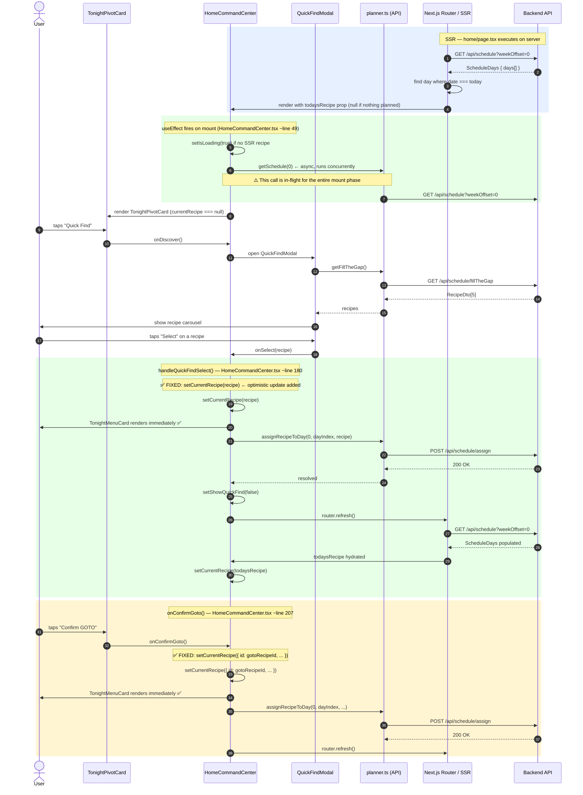

# Flow: Recipe Selection → Home Page (Tonight's Supper)

This diagram traces the complete sequence of events when a user selects a recipe for today's supper and how it (should) appear on the home page as tonight's card.

Two execution paths are shown:
- **Happy path** — the selection completes before the mount reconciliation interferes
- **Race path** — the mount `getSchedule()` call resolves with stale data inside the gap between `assignRecipeToDay` and `router.refresh()`, causing the grey empty card to flash

---

## Sequence Diagram

---

## Optimistic Fix Summary

| Step | Actor | State after |
|------|-------|-------------|
| User selects recipe | User | — |
| `setCurrentRecipe(recipe)` | HCC | `currentRecipe` populated — Menu Card shown immediately ✅ |
| `assignRecipeToDay` starts | HCC | Request in flight |
| `assignRecipeToDay` completes | HCC | `router.refresh()` fires |
| SSR re-hydrates props | Router → HCC | `currentRecipe` updated with final SSR data ✅ |

## Resolution

The race condition was resolved by adding optimistic `setCurrentRecipe(recipe)` calls in `handleQuickFindSelect` and `onConfirmGoto` immediately before the asynchronous `assignRecipeToDay` call. This ensures that the `TonightMenuCard` renders instantly upon user action, providing a snappy experience and bridging the gap before the Next.js `router.refresh()` cycle completes.

Verified via E2E tests in [`pwa/e2e/home-race.spec.ts`](../../pwa/e2e/home-race.spec.ts).
Build prompt: [`specs/05_BUILD_PROMPTS/home-recipe-selection-race-fix.md`](../../specs/05_BUILD_PROMPTS/home-recipe-selection-race-fix.md).
