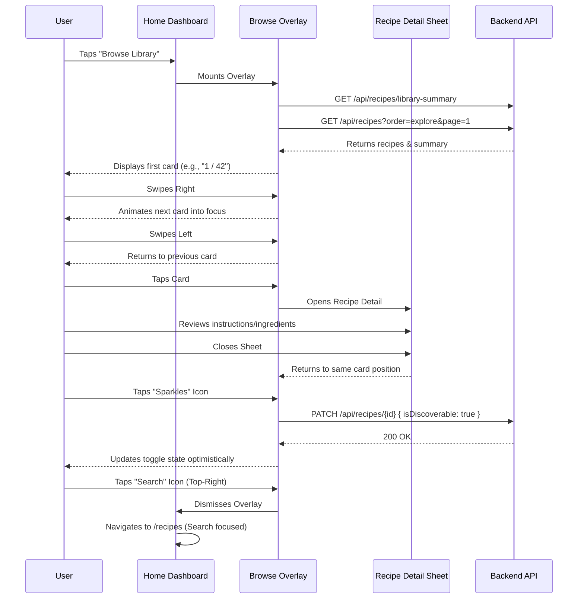

# User Flow: Recipe Stack Browse

The **Recipe Stack Browse** flow provides a tactile, exploratory experience for users to flip through their entire recipe library, rediscovered forgotten favourites, and manage discoverability for family voting.

## Flow Diagram

## Key Interactions

### 1. Entry Points
- **Home Dashboard**: Located below the Quick Capture trigger.
- **Recipes Page**: Located near the top of the library view.

### 2. Navigation
- **Swiping**: Mirrored from the Discovery flow but supports **Back** navigation. Swiping right advances the stack; swiping left retreats.
- **Explore Order**: The stack is sorted by `lastCookedDate ASC NULLS FIRST`. This ensures never-cooked recipes appear first, followed by those not cooked in the longest time.
- **End Card**: Appears when the user reaches the end of their library. Swiping right on the End Card wraps back to the first recipe.

### 3. Management
- **Discoverability**: Users can toggle whether a recipe is "Discoverable" directly from the stack. This affects whether it appears in the family's shared Discovery feed for voting.
- **Search Escape**: If a user finds a recipe they like but wants to find something *similar* or more specific, the magnifying glass icon transitions them directly into the Search experience with a single tap.

## Mobile Considerations
- **Immersive Overlay**: The browser UI (address bar, navigation) is minimized/hidden to focus on the cards.
- **Haptic Feedback**: Subtle haptics provide feedback when dragging cards beyond the navigation threshold.
- **Z-Index Layering**: The browse stack sits above the main application but below critical global notifications.
