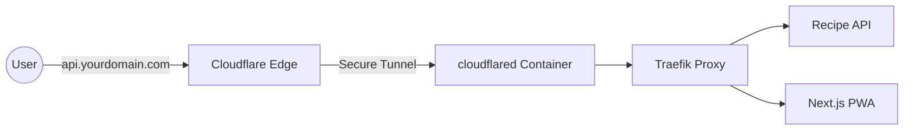

# Specification: Cloudflare Tunnel External Access

This document specifies the architecture and configuration for providing secure external access to the "Whats for Supper?" services running on a Synology NAS using Cloudflare Tunnel.

## Architecture

Cloudflare Tunnel creates a secure, outbound-only connection from your NAS to the Cloudflare edge. This eliminates the need for port forwarding and keeps your origin IP hidden.



## Security Benefits
- **No Open Ports**: Your router remains completely closed to the internet.
- **DDoS Protection**: Cloudflare absorbs any malicious traffic at the edge.
- **Zero Trust Integration**: You can easily add Cloudflare Access (Authentication) to your apps.
- **Implicit SSL**: Cloudflare handles SSL termination at the edge.

## Configuration Details

### 1. Infrastructure Service
Add the following service to `docker-compose.yml` (or `infrastructure.yml`):

```yaml
services:
  tunnel:
    container_name: wfs-tunnel
    image: cloudflare/cloudflared:latest
    restart: unless-stopped
    command: tunnel run
    environment:
      TUNNEL_TOKEN: ${TUNNEL_TOKEN}
    networks:
      - proxy
```

### 2. Traefik Configuration
Traefik must be configured to receive traffic from the tunnel. Since the tunnel points to Traefik internally, Traefik routes based on the `Host` header passed by Cloudflare.

### 3. Application Labels
Each app needs labels to be discovered by Traefik:

```yaml
labels:
  - "traefik.enable=true"
  - "traefik.http.routers.api.rule=Host(`api.yourdomain.com`)"
  - "traefik.http.services.api.loadbalancer.server.port=5000"
```

## Implementation Steps
1. **Create Tunnel**: In [Cloudflare Zero Trust](https://one.dash.cloudflare.com/), create a new tunnel and get the `TUNNEL_TOKEN`.
2. **Add DNS Records**: Point your subdomains (e.g., `api.wfs.com`) to the Tunnel in the Cloudflare dashboard.
3. **Deploy Container**: Add the `tunnel` service to the NAS and ensure it has the token in `.env`.
4. **Update Traefik**: Ensure Traefik is listening on the `proxy` network.
