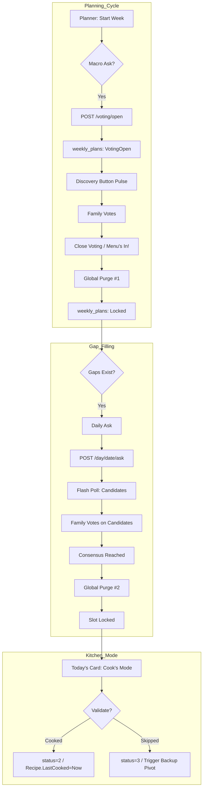

# Planner Feature — Reverse-Engineered Specification
**What's for Supper · Phase 4 (Kitchen & Cook's Mode)**

> **Purpose**: This document is a complete, ground-truth specification assembled by reverse-engineering the live vertical slice — PWA → API → Database. It serves as the authoritative foundation for targeted improvements to this critical feature.
>
> **Phase 4 Update**: This version incorporates high-fidelity decisions regarding **Hearth Secret Security**, **Kindle-style Family Management**, and **Intent-Based Movement**.
>
> **Team**: Four expert personas collaborated on this document:
> - 🎨 **Mère-Designer (UX Lead)** — "Sanity-First UX, The Toddler Rule"
> - 🏗️ **API Architect** — Contract clarity, consistency, performance
> - 🗄️ **Database Engineer** — Schema integrity, query correctness, edge cases
> - 🔬 **QA Lead** — Test coverage, user journeys, failure modes

---

## 1. Feature Overview

The **Planner** is the "Peace of Mind" center of the app. It transforms the weekly meal planning process from a chore into a calm, collaborative ritual. It is the logical endpoint of the Discovery voting flow and the entry point to Cook's Mode.

### 1.1 Core User Goal
> "What are we having this week, and who decided?" — answered in **2 seconds**.

### 1.2 Authentication: The Hearth Secret (No-Password Auth)
To ensure privacy on the public web without the friction of passwords, the app uses a "Digital Key" approach.
- **Global Secret**: A memorable phrase defined in the environment (`HEARTH_SECRET`).
- **Middleware Protection**: All routes (PWA & API) are protected. Requests without a valid `h_access` cookie are redirected to a `/welcome` screen.
- **Magic Invite Links**: `whats-for-supper.app/join?secret={TOKEN}&memberId={UUID}`.
    - Validates the signed token against the secret.
    - Sets persistent cookies (`h_access`, `x-family-member-id`) with a **365-day expiry** to ensure sanctuary-grade persistence.
    - Auto-selects the profile and redirects to `/home`.

### 1.2 Primary Actors
| Actor | Role |
|---|---|
| **Mom/Dad (Planner)** | Owns the week; assigns meals, finalizes the plan |
| **All Family Members** | Vote during Discovery; their consensus drives Smart Defaults |
| **The App** | Auto-populates consensus picks; polls for vote updates |

---

## 2. The UX Slice (Mère-Designer 🎨)

### 2.1 Entry Point
- Route: `/planner` (Next.js App Router, `(app)` layout group)
- Authenticated via `x-family-member-id` cookie (set during onboarding)
- Bottom navigation icon triggers navigation

### 2.2 Screen Architecture

```
PlannerPage (page.tsx)
├── Sticky Header (glass-nav, z-30)
│   ├── Segmented Control: [Planner] [Grocery list]
│   └── Week Navigator: ‹ Apr 28 — May 4 · 3/7 Planned ›
│
├── Main Content (AnimatePresence, mode="wait")
│   ├── SolarLoader (loading state)
│   ├── Grocery Tab Placeholder (coming soon)
│   └── Planner Tab
│       └── Reorder.Group (Framer Motion drag-to-reorder)
│           └── 7× Reorder.Item (day cards)
│               ├── Planned: [Thumbnail] [Recipe Name] [Vote Badge] [👨‍🍳] [⠿]
│               └── Unplanned: [+] "Plan a meal" (animated pulse border)
│
├── Finalize Section
│   ├── [Menu's In!] button (unlocked state)
│   └── [✅ Week finalized / Plan next week] (locked state)
│
├── Settings & Family Management (Kindle-style)
│   ├── [Settings] Icon in Profile view.
│   └── Family Management View: Add/Remove members without profile-switching.
│   └── "Share Invite" button: Triggers Web Share API with a Magic Link.
│
├── Planning Pivot Sheet (AnimatePresence bottom sheet, z-50)
│   ├── "Quick find" → opens QuickFindModal
│   ├── "Search library" → navigates to /recipes?addToDay=N&weekOffset=N
│   └── "Ask the Family" → Unlocks week for voting AND shows **[Nudge Family]** active share button.
│
├── Grocery Tab
│   └── Aisle-First Checklist: Grouped by [Vegetables], [Meat], [Dairy], [Bakery], [Pantry].
│
├── QuickFindModal (z-60, AnimatePresence)
│   └── Flip-card carousel (5 curated picks from /fill-the-gap)
│
└── CooksMode (z-100, AnimatePresence full-screen overlay)
    ├── Step-by-step instructions (sourced from raw_metadata)
    └── Progress bar + Prev/Next navigation

### 2.2.1 Home Page (Command Center)
- Route: `/home` (Default landing)
- **Today's Card**: A high-impact `TonightMenuCard` that serves as the primary CTA.
    - **Flip Interaction**: Tapping the card flips it 180° to reveal the "Back Side".
    - **Back Side**: Displays a concise ingredients list and full description.
    - **Direct Actions**:
        - [👨‍🍳 Cook's Mode] — Launches the full-screen step-by-step overlay.
        - [❌ Skip Tonight] — Triggers the **Recovery Dialog**:
            1. "What's the backup plan?" -> **[🥡 Ordering In]** or **[🔄 Pick Something Else]**.
            2. If "Ordering In", ask: "What about tonight's recipe?" -> **[🗓️ Tomorrow]**, **[⏭️ Next Week]**, or **[🗑️ Drop It]**.
            3. **Mom Stays in Control**: If "Tomorrow" is occupied, prompt: "Drop tomorrow's meal?" or "Push tomorrow to the next empty slot?". (*Swap is excluded here to avoid placing a recipe into tonight's 'Order In' dead zone*).
- **Tonight Pivot**: If no meal is planned for today, the card is replaced by the `TonightPivotCard` offering "Quick Fixes" and fallback options.
```

### 2.3 State Inventory (Zustand + Local React State)

| State | Location | Description |
|---|---|---|
| `currentWeekOffset` | `plannerStore` (Zustand) | 0 = this week, +1 = next week, -1 = last week |
| `activeTab` | `plannerStore` (Zustand) | `'planner'` or `'grocery'` |
| `schedule` | `useState<UILocalScheduleDay[]>` | 7-day array, merged from API + smart defaults |
| `isLocked` | `useState<boolean>` | Mirrors API `locked` field |
| `isLoading` | `useState<boolean>` | Controls SolarLoader visibility |
| `showPivot` | `useState<{dayIndex:number} \| null>` | Controls Planning Pivot Sheet |
| `showQuickFind` | `useState<boolean>` | Controls QuickFindModal |
| `successDay` | `useState<number \| null>` | Triggers success ring animation (3s) |
| `activeCookMode` | `useState<UILocalScheduleDay \| null>` | Active Cook's Mode recipe |
| `draggedId` | `useState<string \| null>` | Tracks dragged card's `_uiId` |
| `prevOffset` | `useState<number>` | Used to determine slide direction |

### 2.4 Local UI Type Extension

```typescript
type UILocalScheduleDay = ScheduleDay & {
  _uiId: string;        // Stable key for Framer Motion Reorder
  _isPending?: boolean; // Smart default not yet persisted to DB
  _voteCount?: number | null;
  _unanimousVote?: boolean | null;
};
```

> 🎨 **Mère-Designer Note**: The `_isPending` flag is a critical UX contract — pending smart defaults appear in the grid immediately (optimistic UI) but are only written to DB on "Menu's In!" finalize. This creates a perceived responsiveness that users love.

### 2.5 Data Hydration Strategy

On `currentWeekOffset` change, the page fires **two parallel API calls**:
1. `GET /api/schedule?weekOffset=X` — committed calendar events
2. `GET /api/schedule/X/smart-defaults` — consensus vote pre-selections (current week only)

The results are **merged** in the frontend:
- If a day has a committed `recipe` → use it, mark `_isPending=false`
- If a day is empty AND a smart default exists for that `dayIndex` → inject it, mark `_isPending=true`
- If neither → empty slot (shows "Plan a meal")

**Polling**: Every 30 seconds (when not locked), `updateVoteCounts()` refreshes vote data and dynamically updates `_voteCount` badges and fills newly-reached consensus slots.

### 2.6 Key Interactions

#### Intent-Based Movement
- **Interaction**: Framer Motion `Reorder.Group` / `Reorder.Item` or Pivot Sheet actions.
- **Logic**: 
    - **Physical Drag**: Dragging a meal onto an occupied slot triggers an immediate **Swap**.
    - **Intent-Based "Push"**: User explicitly chooses to move a meal without swapping.
        - **Push to Next Available**: Finds the first date after `T` with no planned meal and moves the recipe there.
        - **Push to Next Week**: Moves the recipe to `T + 7` (or the next available slot in that week if occupied).
- **API Call**: `POST /api/schedule/move` (supporting `intent` parameter).

#### Social Nudge Flows
- **The "Active Messenger" (Flow 1)**: Tapping "Ask the Family" in the Pivot Sheet reveals a **[Nudge Family]** button. It triggers the Web Share API with a link to the week's Discovery stack.
- **The "Hearth Pulse" (Flow 2)**: When a voting round is open, the **Discovery (Compass)** icon on the bottom nav across all devices pulses in **Ochre** to ambiently invite participation.

#### Planning Pivot Sheet
Triggered by tapping any day card (planned or unplanned).

| Path | Action |
|---|---|
| **Quick Find** | Opens `QuickFindModal` → calls `getFillTheGap()` → flip-card carousel |
| **Search Library** | Navigates to `/recipes?addToDay={N}&weekOffset={N}` |
| **Ask the Family** | Sets `isLocked=false` locally (opens voting) |

#### Quick Find Modal (The Rescue Menu)
- Loads 4 recipes from `GET /api/schedule/fill-the-gap`.
- Flip-card UI: front = hero image + name; back = description + ingredients.
- **The 5th Card (Search Nudge)**: A persistent "Didn't find a match?" card with a large **Search Library** CTA to prevent infinite loops.
- "Select" → `assignRecipeToDay()` + updates local state.
- "Skip" → cycles to next card.

#### Cook's Mode (The Sanity Kitchen)
- Available only for `currentWeekOffset === 0` (current week) or past weeks.
- **Step Persistence**: `plannerStore` tracks `cookProgress: Record<string, number>`. Cook's Mode resumes at the exact step the user last viewed for that recipe (The Toddler Rule).
- **Data Source**: Real instructions parsed from `recipe.raw_metadata` (Schema.org `recipeInstructions`).
- **Post-Meal Validation**: For current/past days, the card displays **[✅ Cooked]** and **[❌ Skipped]** actions.
    - `Cooked` → Sets `status = 2`, updates `Recipe.lastCookedDate`.
    - `Skipped` → Triggers the **Skip Recovery Dialog** (see Section 2.2.1).

#### Grocery Logic: Aisle-First Categorization
- **Strategy**: **Ingredient Section Lookup** with **Fuzzy Matching**.
- **Logic**:
    - The system maintains a global mapping of `Ingredient Name` -> `Store Section` (Meat, Dairy, Bakery, Vegetables, Pantry, Frozen, etc.).
    - **Fuzzy Matching**: Since ingredient names vary between recipes (e.g., "Chicken Breast" vs "Skinless Chicken Breast"), the lookup uses fuzzy string matching to find the closest existing category.
    - When a new ingredient is imported that doesn't significantly match an existing entry, the system uses a **one-time AI turn** to categorize it and update the global lookup.
    - This ensures `recipe.json` files remain 100% faithful to the **Schema.org Recipe Ontology**.
    - Future recipes containing known or "close-match" ingredients incur **zero token cost** for categorization.

#### Finalize ("Menu's In!")
1. **Closing Voting**: Transitions `weekly_plans.status` from `VotingOpen` to `Finalizing`.
2. **Persistence**: For each `_isPending` day with a recipe → `POST /api/schedule/assign` (persists to DB).
3. **Locking**: Then → `POST /api/schedule/lock?weekOffset=X` (locks all events).
4. **Purge**: Triggers global purge of `recipe_votes`.
5. UI transitions to "Week finalized" state.

#### Remove / Un-assign
- **Placement**: To reduce card clutter, the "Remove" action is located in the **Planning Pivot Sheet** (accessed by tapping the recipe card).
- **Action**: `DELETE /api/schedule/{date}/remove`.
- **Effect**: Reverts the day card to the "Plan a meal" (empty) state.

### 2.7 Mock Fallback
If API calls fail, the page renders **hardcoded mock data** (Mon: Homemade Lasagna, Wed: Zesty Lemon Chicken) so the UI experience is always demonstrable. This is a development/resilience pattern.

---

## 3. The API Slice (API Architect 🏗️)

### 3.1 Controller: `ScheduleController`
**Route prefix**: `api/schedule`
**File**: `api/src/RecipeApi/Controllers/ScheduleController.cs`

All responses are auto-wrapped in `{ data: ... }` by `SuccessWrappingFilter`.

### 3.2 Endpoint Contracts

#### `GET /api/schedule?weekOffset={int}`
**Service call**: `ScheduleService.GetScheduleAsync(weekOffset)`

**Response shape:**
```json
{
  "data": {
    "weekOffset": 0,
    "locked": false,
    "days": [
      {
        "day": "Mon",
        "date": "2026-04-28",
        "recipe": {
          "id": "uuid",
          "name": "Pasta Carbonara",
          "image": "/api/recipes/{id}/hero",
          "voteCount": null,
          "ingredients": null,
          "description": null
        }
      }
    ]
  }
}
```

**Locked logic**: `locked = true` if ANY calendar event in the week has `status = Locked (1)`.

---

#### `POST /api/schedule/lock?weekOffset={int}`
**Service call**: `ScheduleService.LockScheduleAsync(weekOffset)`

**Side effects (in order)**:
1. Fetches `Planned` events for the week.
2. Updates `weekly_plans.status = Locked`.
3. Sets each event's `Status = Locked`, persists vote count snapshot to `VoteCount`.
4. **Deletes ALL `recipe_votes`** (Global Purge #1).
5. `SaveChangesAsync()`.

---

#### `POST /api/schedule/voting/open?weekOffset={int}`
**Goal**: The "Macro" Ask (Whole week).
1. Creates/Updates `weekly_plans` record for the week.
2. Sets `status = VotingOpen`.
3. Triggers "Pulse" on Discovery button for all family members.

---

#### `GET /api/schedule/fill-the-gap?weekOffset={int}`
**Goal**: Suggest 5 recipes to fill empty slots.
**Selection Logic ("Most Popular Quick")**:
1.  **Filter**: `is_discoverable = true` AND `total_time` contains keywords like "10", "15", "20", "25" minutes (or numeric equivalent < 30 mins).
2.  **Popularity**: Order by `vote_count` (from `vw_recipe_matches`) DESC.
3.  **Variety**: Filter out recipes already planned for the current week.
4.  **Recency**: Secondary sort by `last_cooked_date` ASC (prioritize things we haven't had lately).

---

#### `POST /api/schedule/day/{date}/validate` (Body: `ValidationDto`)
**Goal**: Mark meal as Cooked/Skipped.
1.  **If `status = Cooked` (2)**:
    - Update event `status = 2`.
    - Update `Recipe.LastCookedDate = UtcNow`.
2.  **If `status = Skipped` (3)**:
    - **Semantics**: "Planned but not cooked." The family decided against this specific meal today (e.g., ordered pizza, too busy).
    - Update event `status = 3`.
    - **UX Recovery**: UI should prompt: "Want to move this to tomorrow?"
    - **Movement Behavior**: Moving a skipped meal to tomorrow triggers the **Global Domino Shift**. All subsequent planned meals in the calendar (even in future weeks) shift forward to accommodate the change.

### 3.3 DTO Inventory

| DTO | Fields |
|---|---|
| `ScheduleDays` | `weekOffset`, `locked`, `days[]` |
| `ScheduleDayDto` | `day`, `date`, `recipe?` |
| `ScheduleRecipeDto` | `id`, `name`, `image`, `voteCount?`, `ingredients?`, `description?` |
| `MoveScheduleDto` | `weekOffset`, `fromIndex`, `toIndex` |
| `AssignScheduleDto` | `weekOffset`, `dayIndex`, `recipeId` |
| `SmartDefaultsDto` | `weekOffset`, `familySize`, `consensusThreshold`, `preSelectedRecipes[]`, `openSlots[]`, `consensusRecipesCount` |
| `PreSelectedRecipeDto` | `recipeId`, `name`, `heroImageUrl`, `voteCount`, `familySize`, `unanimousVote`, `dayIndex`, `isLocked` |
| `OpenSlotDto` | `dayIndex` |

### 3.4 PWA API Client (`pwa/src/lib/api/planner.ts`)

Auto-generated client via `apiClient` (Kiota-style). Key gap identified:

```typescript
// assignRecipeToDay passes recipe.image but it's NOT in AssignScheduleDto
// The extra fields (name, image) are silently dropped by the API
export const assignRecipeToDay = async (weekOffset, dayIndex, recipe) => {
  return await apiClient.api.schedule.assign.post({
    weekOffset,
    dayIndex,
    recipeId: recipe.id,  // ✅ used
    // recipe.name and recipe.image are NOT sent — they're used only for local state
  });
};
```

---

## 4. The Database Slice (Database Engineer 🗄️)

### 4.1 Core Tables Involved

#### `weekly_plans`
```sql
CREATE TABLE weekly_plans (
  id uuid PRIMARY KEY DEFAULT gen_random_uuid(),
  week_start_date date UNIQUE NOT NULL,
  status smallint NOT NULL DEFAULT 0, -- 0=Draft, 1=VotingOpen, 2=Locked
  notified_at timestamptz,
  grocery_state jsonb,                -- Map of { "Ingredient Name": boolean }
  created_at timestamptz DEFAULT now() NOT NULL
);
CREATE INDEX idx_weekly_plans_date ON weekly_plans (week_start_date);
```

#### `calendar_events`
```sql
CREATE TABLE calendar_events (
  id uuid PRIMARY KEY DEFAULT gen_random_uuid(),
  recipe_id uuid NOT NULL REFERENCES recipes(id) ON DELETE CASCADE,
  date date NOT NULL,
  meal_slot smallint NOT NULL DEFAULT 0, -- 0=Supper, 1=Lunch, 2=Breakfast
  status smallint NOT NULL,              -- 0=Planned, 1=Locked, 2=Cooked, 3=Skipped, 4=AwaitingConsensus
  vote_count integer,                    -- snapshot at lock time
  candidate_ids uuid[],                  -- used for daily flash-polls
  CONSTRAINT calendar_events_status_check CHECK (status >= 0 AND status <= 4),
  CONSTRAINT calendar_events_date_slot_unique UNIQUE (date, meal_slot)
);
CREATE INDEX idx_calendar_events_recipe_id ON calendar_events (recipe_id);
CREATE INDEX idx_calendar_events_date ON calendar_events (date);
```

> 🗄️ **DB Engineer Note**: The `UNIQUE(date, meal_slot)` constraint is now the source of truth for single-assignment per slot.

#### `recipe_votes`
```sql
CREATE TABLE recipe_votes (
  recipe_id uuid NOT NULL REFERENCES recipes(id) ON DELETE CASCADE,
  family_member_id uuid NOT NULL REFERENCES family_members(id) ON DELETE CASCADE,
  vote smallint NOT NULL,             -- 1=Like, 2=Dislike
  voted_at timestamptz DEFAULT now() NOT NULL,
  PRIMARY KEY (recipe_id, family_member_id),
  CONSTRAINT recipe_votes_vote_check CHECK (vote >= 1 AND vote <= 2)
);
```

#### `recipes` (planner-relevant columns)
```sql
last_cooked_date timestamptz  -- Set to UtcNow on LockSchedule
is_discoverable boolean       -- Controls vw_discovery_recipes fallback
```

### 4.2 Database Views

#### `vw_recipe_matches`
```sql
SELECT recipe_id, count(recipe_id) AS vote_count
FROM recipe_votes
WHERE vote = 1  -- Like only
GROUP BY recipe_id;
```
Mapped as EF Core entity `RecipeMatch` (keyed on `recipe_id`).

#### `vw_discovery_recipes`
```sql
SELECT r.id, r.name, r.category, r.description, r.ingredients,
       r.image_count, r.difficulty, r.total_time, r.is_vegetarian,
       r.is_healthy_choice, r.last_cooked_date, r.created_at,
       COALESCE(v.vote_count, 0) AS vote_count
FROM recipes r
LEFT JOIN (SELECT recipe_id, count(*) AS vote_count FROM recipe_votes WHERE vote=1 GROUP BY recipe_id) v
  ON r.id = v.recipe_id
WHERE r.is_discoverable = true;
```

### 4.3 Key Queries (Annotated)

**GetScheduleAsync** — week fetch:
```sql
-- EF: CalendarEvents.Include(Recipe).Where(date IN week)
SELECT ce.*, r.*
FROM calendar_events ce
JOIN recipes r ON ce.recipe_id = r.id
WHERE ce.date >= '2026-04-28' AND ce.date <= '2026-05-04'
```

**GetSmartDefaultsAsync** — consensus computation:
```sql
-- Step 1: Count Like votes
SELECT recipe_id, COUNT(*) AS vote_count
FROM recipe_votes WHERE vote = 1
GROUP BY recipe_id
-- Filter: vote_count >= ceil((family_size + 1) / 2)
```

**LockScheduleAsync** — vote snapshot + purge:
```sql
-- Snapshot vote counts
UPDATE calendar_events SET status=1, vote_count=... WHERE week AND status=0;
UPDATE recipes SET last_cooked_date=NOW() WHERE id IN (...);
-- Purge all votes (global)
DELETE FROM recipe_votes;
```

---

## 5. The QA Slice (QA Lead 🔬)

### 5.1 Existing E2E Test Coverage (`pwa/e2e/planner.spec.ts`)

| Test | Status | Notes |
|---|---|---|
| Display segmented control (Planner/Grocery tabs) | ✅ | |
| Display 7 daily cards | ✅ | |
| Week navigation via chevrons | ✅ | Checks date range change |
| Open Planning Pivot Sheet (3 paths visible) | ✅ | |
| Search-to-Planner round-trip with success ring | ✅ | Uses `?success=1&dayIndex=N` URL pattern |
| Cook's Mode: open, navigate steps, close | ✅ | |
| Smart defaults merged into grid | ✅ | Minimal (count check only) |
| Drag-to-reorder (reorder group visible) | ✅ | Minimal (existence check only) |
| Finalize ("Menu's In!") → locks week | ✅ | |

### 5.2 Identified Gaps & Friction Points

#### 🎨 UX Gaps
1. **Cook's Mode steps** — Need to implement parsing from `raw_metadata` (Option B).
2. **"Ask the Family" Implementation** — Need to implement the `weekly_plans` table and API endpoints.
3. **Grocery Tab Checklist** — Transition from static placeholder to interactive checklist.
4. **Remove/Un-assign** — Add "X" button to day cards and implement `DELETE /api/schedule/{date}/remove`.
5. **Post-Meal Validation** — Add [✅ Cooked] / [❌ Skipped] UI to cards.

#### 🏗️ API Gaps
1. **No `weekly_plans` table** — Need migration and EF model.
2. **Sequential Purge** — Update `LockScheduleAsync` and implement `AwaitingConsensus` auto-purge.
3. **`FillTheGapAsync` duplicates** — Should filter out recipes already assigned to the week.

#### 🗄️ Database Gaps
1. **Composite Constraint** — Add `UNIQUE(date, meal_slot)` to `calendar_events`.
2. **`candidate_ids` column** — Add to `calendar_events` for flash-polls.

#### 🔬 Test Gaps
1. **Drag-to-reorder test is shallow** — only checks the group exists; does not verify the API call fires or the order updates.
2. **No test for polling behavior** — vote count updates at 30s interval are untested.
3. **"Ask the Family" path is untested** — no E2E coverage.
4. **Cook's Mode step content is untested** — tests only verify the step indicator label, not instruction text.
5. **No test for the mock fallback path** — when API is down, the mock data should render; currently untested.
6. **No API-level tests for ScheduleService** — edge cases (empty week, all slots occupied, no family members) need unit test coverage.

---

## 6. Data Flow Diagram



---

## 7. Resolved Decisions Log

1.  **Cook's Mode steps**: Sourced from `recipe.raw_metadata` (Option B: Raw text).
2.  **"Ask the Family" Persistent State**: Implemented via `weekly_plans` table.
3.  **Hierarchy**: Sequential Ask (Weekly Macro -> Daily Micro). 
4.  **Pulse**: The Discovery button is the universal CTA for family members.
5.  **Vote Purge**: Global purge is retained but triggered sequentially (at Lock and at Consensus).
6.  **Uniqueness**: Composite `UNIQUE(date, meal_slot)` added to schema.
7.  **Grocery List**: Aggregated ingredients from `supply` metadata. Toggling an item ("Purchased") syncs to `weekly_plans.grocery_state` (JSONB) to support collaborative shopping across multiple stores.
8.  **Validation**: Manual "Cooked" vs "Skipped".
9.  **Declutter**: "Remove" action moved from cards to the Pivot Menu.
10. **Persistence**: Intent-based "Push" actions replace the Global Domino Shift for movement, while `recipes.added_by` uses `ON DELETE SET NULL` to preserve data when members are removed.

---

## 8. Implementation Files Reference

| Layer | File | Purpose |
|---|---|---|
| **PWA Page** | `pwa/src/app/(app)/planner/page.tsx` | Main planner page (869 lines) |
| **PWA Store** | `pwa/src/store/plannerStore.ts` | Zustand: weekOffset, activeTab |
| **PWA API Client** | `pwa/src/lib/api/planner.ts` | 6 API call wrappers |
| **PWA Component** | `pwa/src/components/planner/QuickFindModal.tsx` | Flip-card carousel |
| **PWA Component** | `pwa/src/components/planner/CooksMode.tsx` | Step-by-step cook overlay |
| **API Controller** | `api/src/RecipeApi/Controllers/ScheduleController.cs` | 6 endpoints |
| **API Service** | `api/src/RecipeApi/Services/ScheduleService.cs` | 5 public methods, 296 lines |
| **API DTOs** | `api/src/RecipeApi/Dto/ScheduleDays.cs` | Schedule response shapes |
| **API DTOs** | `api/src/RecipeApi/Dto/SmartDefaultsDto.cs` | Consensus response shapes |
| **API DTOs** | `api/src/RecipeApi/Dto/MoveScheduleDto.cs` | Move request |
| **API DTOs** | `api/src/RecipeApi/Dto/AssignScheduleDto.cs` | Assign request |
| **DB Model** | `api/src/RecipeApi/Models/CalendarEvent.cs` | EF entity + status enum |
| **DB Model** | `api/src/RecipeApi/Models/RecipeMatch.cs` | EF entity for `vw_recipe_matches` |
| **DB Schema** | `api/database/schema.sql` | Source of truth for all tables/views |
| **OpenAPI** | `specs/openapi.yaml` | (Lines 687–835 cover schedule endpoints) |
| **E2E Tests** | `pwa/e2e/planner.spec.ts` | 8 Playwright tests |

---

*Generated: 2026-04-28 · Assembled from live code reverse-engineering*
